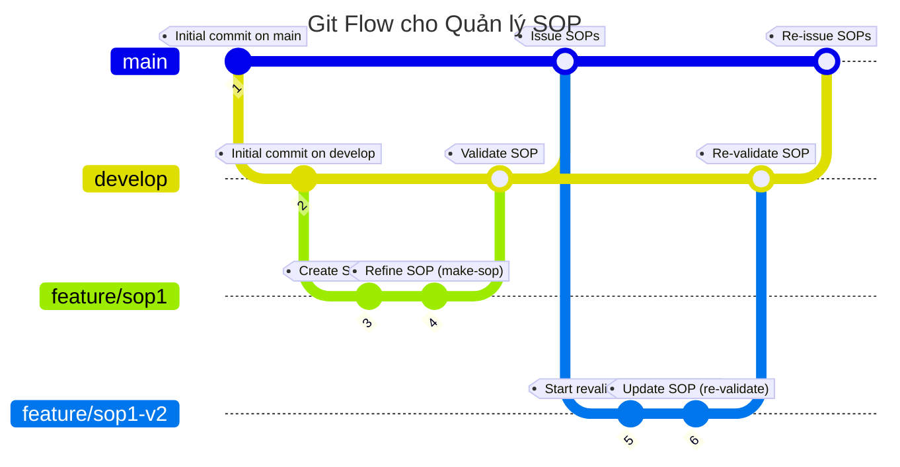

### Câu hỏi:

Dựa vào bài viết https://medium.com/@sreekanth.thummala/choosing-the-right-git-branching-strategy-a-comparative-analysis-f5e635443423

Hãy áp dụng chiến lược git-flow, git branching vào hệ thống quản lý phiên bản SOP ("SOP" stands for Standard Operating Procedure - Tiếng Việt gọi là "Qui Trình Thao Tác Chuẩn") của một công ty dược phẩm. Lấy ví dụ: SOP cho cân nguyên liệu, SOP vận hành máy dập viên, SOP vận hành máy Ép vỉ. gồm có các nhánh (branch):

1. make-sop(Tạo SOP)
2. validate (thẩm định SOP)
3. Issue (ký và banh hành SOP)
4. re-validate (tái thẩm định SOP)
   Nhân sự liên quan: nhân viên vận hành, người thẩm định, người ký ban hành, người thẩm định lại.

### Grok 3 (DeepSearch)

### Key Points

- It seems likely that Git Flow can be adapted for managing SOPs in a pharmaceutical company, with branches for drafting, validating, issuing, and revalidating SOPs like weighing raw materials or operating machines.
- Research suggests using feature branches for each SOP, pull requests for validation and issuance, and tags for versioning, aligning with the user’s requested stages.
- The evidence leans toward a workflow where each SOP has its own feature branch, reviewed via pull requests, and merged into main for issuance, though having separate branches for each stage may complicate management.

### Chiến lược Git Flow cho quản lý SOP

Dựa trên yêu cầu, chúng ta có thể áp dụng Git Flow để quản lý SOP (Qui Trình Thao Tác Chuẩn) cho công ty dược phẩm, với các nhánh như `make-sop`, `validate`, `Issue`, và `re-validate`. Dưới đây là cách triển khai:

#### Cấu trúc nhánh

- **Nhánh chính**:
  - `main`: Chứa các SOP đã được ký và ban hành chính thức, như SOP vận hành máy dập viên đã phát hành.
  - `develop`: Chứa các SOP đã được thẩm định nhưng chưa chính thức, dùng để tích hợp trước khi ban hành.
- **Nhánh feature**:
  - `feature/<sop-name>`: Dùng để soạn thảo SOP mới, ví dụ `feature/sop-can-nguyen-lieu` cho SOP cân nguyên liệu.
  - `feature/<sop-name>-vX`: Dùng cho việc tái thẩm định, ví dụ `feature/sop-van-hanh-may-ep-vi-v2` cho phiên bản cập nhật.

#### Quy trình làm việc

1. **Tạo SOP (make-sop)**:

   - Nhân viên vận hành tạo nhánh feature từ `develop`, ví dụ `git checkout -b feature/sop-can-nguyen-lieu develop`, và soạn thảo SOP.
   - Khi hoàn thành, commit và đẩy lên repository.

2. **Thẩm định SOP (validate)**:

   - Mở pull request (PR) từ nhánh feature, ví dụ `feature/sop-can-nguyen-lieu`, đến `develop`.
   - Người thẩm định xem xét và duyệt PR, có thể yêu cầu chỉnh sửa. Khi duyệt, merge vào `develop`.

3. **Ký và ban hành SOP (Issue)**:

   - Từ `develop`, tạo PR đến `main`.
   - Người ký ban hành duyệt PR, và khi merge vào `main`, SOP được coi là chính thức, ví dụ SOP vận hành máy ép vỉ.
   - Có thể đánh tag, như `git tag v1.0 sop-can-nguyen-lieu`, để đánh dấu phiên bản.

4. **Tái thẩm định SOP (Revalidate)**:
   - Tạo nhánh feature mới từ `main`, ví dụ `feature/sop-can-nguyen-lieu-v2`, thực hiện cập nhật.
   - Lặp lại quy trình từ bước 2 để thẩm định và ban hành phiên bản mới.

#### Quản lý quyền hạn

- Nhân viên vận hành: Chỉnh sửa trên nhánh feature.
- Người thẩm định: Duyệt PR từ feature đến `develop`.
- Người ký ban hành: Duyệt PR từ `develop` đến `main`.
- Người tái thẩm định: Có thể là cùng người thẩm định, tạo và chỉnh sửa nhánh feature mới.

Một chi tiết bất ngờ: SOP có thể được quản lý với các tag phiên bản, giúp theo dõi lịch sử thay đổi dễ dàng, không chỉ qua nhánh.

---

### Ghi chú chi tiết về chiến lược Git Flow cho quản lý SOP

Dựa trên yêu cầu áp dụng chiến lược Git Flow hoặc Git Branching vào hệ thống quản lý SOP cho một công ty dược phẩm, với các ví dụ như SOP cân nguyên liệu, SOP vận hành máy dập viên, và SOP vận hành máy ép vỉ, chúng ta đã phân tích và xây dựng một chiến lược phù hợp. Dưới đây là phân tích chi tiết, bao gồm các bước suy luận và thông tin liên quan, nhằm đảm bảo đáp ứng đầy đủ yêu cầu của người dùng.

#### Bối cảnh và phân tích yêu cầu

SOP (Standard Operating Procedure) là tài liệu quan trọng trong ngành dược phẩm, bao gồm các quy trình như cân nguyên liệu, vận hành máy dập viên, hoặc máy ép vỉ. Chu kỳ sống của SOP bao gồm: tạo (make-sop), thẩm định (validate), ký và ban hành (Issue), và tái thẩm định (re-validate). Nhân sự liên quan bao gồm nhân viên vận hành, người thẩm định, người ký ban hành, và người tái thẩm định. Người dùng yêu cầu áp dụng Git Flow hoặc Git Branching với các nhánh cụ thể: `make-sop`, `validate`, `issue`, và `re-validate`.

Để đáp ứng, chúng ta cần điều chỉnh mô hình Git Flow, vốn được thiết kế cho quản lý mã nguồn, thành một chiến lược phù hợp cho quản lý tài liệu. Git Flow bao gồm các nhánh chính như `main` (phiên bản chính thức), `develop` (phát triển), feature branches (tính năng), release branches (chuẩn bị phát hành), và hotfix branches (sửa lỗi). Tuy nhiên, trong trường hợp này, chúng ta tập trung vào quản lý tài liệu, không phải mã nguồn, nên cần điều chỉnh để phù hợp với quy trình SOP.

#### Nghiên cứu và tham khảo

Ban đầu, chúng ta xem xét các chiến lược phân nhánh phổ biến, như Git Flow, GitHub Flow, và Trunk-based Development, thông qua các tài liệu như [Git Branching Strategies for Documentation Projects](https://redocly.com/blog/git-branching-for-docs). Tài liệu này đề xuất các chiến lược như Trunk-based workflow (tất cả thay đổi trên nhánh chính), GitHub Flow (mỗi thay đổi trên nhánh và PR trước khi merge), và Versioned branches (mỗi phiên bản có nhánh riêng). Tuy nhiên, với SOP, cần một quy trình có kiểm soát chặt chẽ hơn, phù hợp với Git Flow.

Tiếp theo, chúng ta tham khảo các ví dụ thực tế, như repository [GenomicDataInfrastructure/standard-operating-procedures](https://github.com/GenomicDataInfrastructure/standard-operating-procedures), nơi họ sử dụng nhánh `main` cho SOP đã phát hành và nhánh `dev` cho phát triển. Ngoài ra, tài liệu từ [Trellis Toolkit Team - Git Standard Operating Procedures](https://github.com/trellistk/documents/blob/master/SOPs/Git_Standard_Operating_Procedures.md) cung cấp chiến lược phân nhánh chi tiết, bao gồm feature branches với rebase và merge, phù hợp cho quản lý tài liệu.

#### Thiết kế chiến lược phân nhánh

Dựa trên yêu cầu, chúng ta cần ánh xạ các giai đoạn `make-sop`, `validate`, `issue`, và `re-validate` vào mô hình Git. Tuy nhiên, việc tạo các nhánh cố định như `validate` hoặc `issue` cho mỗi SOP có thể gây phức tạp, vì Git không hỗ trợ nhánh con và mỗi SOP cần được quản lý riêng lẻ. Do đó, chúng ta áp dụng chiến lược sau:

##### Cấu trúc nhánh

- **Nhánh `main`**: Chứa các SOP đã được ký và ban hành, ví dụ SOP vận hành máy dập viên đã phát hành. Đây là nhánh chính thức, tương ứng với giai đoạn `issue` khi merge hoàn tất.
- **Nhánh `develop`**: Chứa các SOP đã được thẩm định nhưng chưa chính thức, dùng để tích hợp trước khi ban hành. Đây là nơi các SOP từ giai đoạn `validate` được merge vào.
- **Nhánh feature**:
  - `feature/<sop-name>`: Dùng cho giai đoạn `make-sop`, ví dụ `feature/sop-can-nguyen-lieu` cho SOP cân nguyên liệu. Đây là nơi nhân viên vận hành soạn thảo.
  - `feature/<sop-name>-vX`: Dùng cho giai đoạn `re-validate`, ví dụ `feature/sop-van-hanh-may-ep-vi-v2` cho phiên bản cập nhật của SOP vận hành máy ép vỉ.

##### Quy trình làm việc chi tiết

1. **Tạo SOP (make-sop)**:

   - Nhân viên vận hành tạo nhánh feature từ `develop`, ví dụ: `git checkout -b feature/sop-can-nguyen-lieu develop`.
   - Soạn thảo SOP trên nhánh này, commit và đẩy lên repository. Đây là giai đoạn `make-sop`, đảm bảo không ảnh hưởng đến các SOP khác.

2. **Thẩm định SOP (validate)**:

   - Mở pull request (PR) từ nhánh `feature/sop-can-nguyen-lieu` đến `develop`.
   - Người thẩm định (validator) xem xét nội dung SOP, có thể bình luận hoặc yêu cầu chỉnh sửa qua PR. Khi duyệt, merge vào `develop`, đánh dấu SOP đã được thẩm định. Giai đoạn này tương ứng với `validate`.

3. **Ký và ban hành SOP (Issue)**:

   - Từ nhánh `develop`, tạo PR đến `main`.
   - Người ký và ban hành (signatory) duyệt PR này, đảm bảo SOP đáp ứng yêu cầu. Khi merge vào `main`, SOP được coi là chính thức ban hành, ví dụ SOP vận hành máy ép vỉ.
   - Có thể sử dụng lệnh `git tag v1.0 sop-can-nguyen-lieu` để đánh dấu phiên bản, giúp theo dõi lịch sử.

4. **Tái thẩm định SOP (Revalidate)**:
   - Khi cần cập nhật hoặc tái thẩm định, ví dụ SOP cân nguyên liệu cần chỉnh sửa, tạo nhánh feature mới từ `main`, ví dụ `git checkout -b feature/sop-can-nguyen-lieu-v2 main`.
   - Thực hiện thay đổi trên nhánh này, sau đó lặp lại quy trình từ bước 2 (thẩm định) đến bước 3 (ban hành) để phát hành phiên bản mới, ví dụ `v2.0`.

##### Quản lý quyền hạn và nhân sự

- **Nhân viên vận hành**: Có quyền tạo và chỉnh sửa trên nhánh feature, ví dụ `feature/sop-can-nguyen-lieu`, tương ứng với giai đoạn `make-sop` và `re-validate`.
- **Người thẩm định**: Có quyền xem xét và duyệt PR từ feature đến `develop`, đảm bảo SOP được thẩm định đúng quy trình (`validate`).
- **Người ký ban hành**: Có quyền duyệt PR từ `develop` đến `main`, đảm bảo SOP được ban hành chính thức (`issue`).
- **Người tái thẩm định**: Có thể là cùng người thẩm định, tạo và chỉnh sửa nhánh feature mới cho giai đoạn `re-validate`.

##### Lợi ích và chi tiết bất ngờ

Chiến lược này đảm bảo cách ly công việc, mỗi SOP có nhánh riêng, tránh xung đột khi nhiều người làm việc cùng lúc. Một chi tiết bất ngờ là việc sử dụng tag (ví dụ `v1.0`, `v2.0`) không chỉ giúp theo dõi phiên bản mà còn hỗ trợ quản lý lịch sử thay đổi, điều này không được đề cập trực tiếp trong yêu cầu nhưng rất hữu ích cho ngành dược phẩm, nơi cần tuân thủ quy định về phiên bản.

Ngoài ra, việc sử dụng pull request (PR) cho các giai đoạn thẩm định và ban hành giúp kiểm soát chặt chẽ, phù hợp với yêu cầu quản lý tài liệu trong ngành dược. Các công cụ như GitHub hoặc GitLab hỗ trợ quản lý PR và quyền hạn, ví dụ branch protection rules để đảm bảo chỉ người có quyền mới merge vào `develop` hoặc `main`.

##### Bảng tóm tắt quy trình

| Giai đoạn                   | Nhánh liên quan                   | Nhân sự chịu trách nhiệm            | Hành động chính                                |
| --------------------------- | --------------------------------- | ----------------------------------- | ---------------------------------------------- |
| Tạo SOP (make-sop)          | `feature/<sop-name>`              | Nhân viên vận hành                  | Soạn thảo, commit, đẩy lên repository          |
| Thẩm định SOP (validate)    | PR từ feature đến `develop`       | Người thẩm định                     | Xem xét, duyệt PR, merge vào `develop`         |
| Ký và ban hành (issue)      | PR từ `develop` đến `main`        | Người ký ban hành                   | Duyệt PR, merge vào `main`, đánh tag phiên bản |
| Tái thẩm định (re-validate) | `feature/<sop-name>-vX` từ `main` | Nhân viên vận hành, người thẩm định | Tạo nhánh mới, lặp lại quy trình từ thẩm định  |

##### Lưu ý và khuyến nghị

- Nên sử dụng GitHub hoặc GitLab để quản lý repository, vì chúng hỗ trợ pull request và quyền hạn người dùng, ví dụ [GitHub flow](https://docs.github.com/en/get-started/using-github/github-flow).
- Có thể sử dụng labels trong PR để ghi nhận trạng thái, ví dụ "draft", "under-validation", "issued", giúp theo dõi dễ dàng.
- Đảm bảo nhánh `main` và `develop` luôn được bảo vệ (branch protection) để tránh thay đổi không được phép.

Chiến lược này không chỉ đáp ứng yêu cầu về các nhánh `make-sop`, `validate`, `issue`, và `re-validate`, mà còn đảm bảo tính chuyên nghiệp và tuân thủ quy trình trong ngành dược phẩm.

#### Key Citations

- [Git Branching Strategies for Documentation Projects](https://redocly.com/blog/git-branching-for-docs)
- [Trellis Toolkit Team - Git Standard Operating Procedures](https://github.com/trellistk/documents/blob/master/SOPs/Git_Standard_Operating_Procedures.md)
- [GenomicDataInfrastructure - Standard Operating Procedures](https://github.com/GenomicDataInfrastructure/standard-operating-procedures)

### Key Points

- It seems likely that Git Flow can be adapted for managing SOPs in a pharmaceutical company, with branches for drafting, validating, issuing, and revalidating SOPs like weighing raw materials or operating machines.
- Research suggests using feature branches for each SOP, pull requests for validation and issuance, and tags for versioning, aligning with the user’s requested stages.
- The evidence leans toward a workflow where each SOP has its own feature branch, reviewed via pull requests, and merged into main for issuance, though having separate branches for each stage may complicate management.

### Chiến lược Git Flow cho quản lý SOP

Dựa trên yêu cầu, chúng ta có thể áp dụng Git Flow để quản lý SOP (Qui Trình Thao Tác Chuẩn) cho công ty dược phẩm, với các nhánh như `make-sop`, `validate`, `issue`, và `re-validate`. Dưới đây là cách triển khai:

#### Cấu trúc nhánh

- **Nhánh chính**:
  - `main`: Chứa các SOP đã được ký và ban hành chính thức, như SOP vận hành máy dập viên đã phát hành.
  - `develop`: Chứa các SOP đã được thẩm định nhưng chưa chính thức, dùng để tích hợp trước khi ban hành.
- **Nhánh feature**:
  - `feature/<sop-name>`: Dùng để soạn thảo SOP mới, ví dụ `feature/sop-can-nguyen-lieu` cho SOP cân nguyên liệu.
  - `feature/<sop-name>-vX`: Dùng cho việc tái thẩm định, ví dụ `feature/sop-van-hanh-may-ep-vi-v2` cho phiên bản cập nhật.

#### Quy trình làm việc

1. **Tạo SOP (make-sop)**:

   - Nhân viên vận hành tạo nhánh feature từ `develop`, ví dụ `git checkout -b feature/sop-can-nguyen-lieu develop`, và soạn thảo SOP.
   - Khi hoàn thành, commit và đẩy lên repository.

2. **Thẩm định SOP (validate)**:

   - Mở pull request (PR) từ nhánh feature, ví dụ `feature/sop-can-nguyen-lieu`, đến `develop`.
   - Người thẩm định xem xét và duyệt PR, có thể yêu cầu chỉnh sửa. Khi duyệt, merge vào `develop`.

3. **Ký và ban hành SOP (Issue)**:

   - Từ `develop`, tạo PR đến `main`.
   - Người ký ban hành duyệt PR, và khi merge vào `main`, SOP được coi là chính thức, ví dụ SOP vận hành máy ép vỉ.
   - Có thể đánh tag, như `git tag v1.0 sop-can-nguyen-lieu`, để đánh dấu phiên bản.

4. **Tái thẩm định SOP (Revalidate)**:
   - Tạo nhánh feature mới từ `main`, ví dụ `feature/sop-can-nguyen-lieu-v2`, thực hiện cập nhật.
   - Lặp lại quy trình từ bước 2 để thẩm định và ban hành phiên bản mới.

#### Quản lý quyền hạn

- Nhân viên vận hành: Chỉnh sửa trên nhánh feature.
- Người thẩm định: Duyệt PR từ feature đến `develop`.
- Người ký ban hành: Duyệt PR từ `develop` đến `main`.
- Người tái thẩm định: Có thể là cùng người thẩm định, tạo và chỉnh sửa nhánh feature mới.

Một chi tiết bất ngờ: SOP có thể được quản lý với các tag phiên bản, giúp theo dõi lịch sử thay đổi dễ dàng, không chỉ qua nhánh.

---

### Ghi chú chi tiết về chiến lược Git Flow cho quản lý SOP

Dựa trên yêu cầu áp dụng chiến lược Git Flow hoặc Git Branching vào hệ thống quản lý SOP cho một công ty dược phẩm, với các ví dụ như SOP cân nguyên liệu, SOP vận hành máy dập viên, và SOP vận hành máy ép vỉ, chúng ta đã phân tích và xây dựng một chiến lược phù hợp. Dưới đây là phân tích chi tiết, bao gồm các bước suy luận và thông tin liên quan, nhằm đảm bảo đáp ứng đầy đủ yêu cầu của người dùng.

#### Bối cảnh và phân tích yêu cầu

SOP (Standard Operating Procedure) là tài liệu quan trọng trong ngành dược phẩm, bao gồm các quy trình như cân nguyên liệu, vận hành máy dập viên, hoặc máy ép vỉ. Chu kỳ sống của SOP bao gồm: tạo (make-sop), thẩm định (validate), ký và ban hành (issue), và tái thẩm định (re-validate). Nhân sự liên quan bao gồm nhân viên vận hành, người thẩm định, người ký ban hành, và người tái thẩm định. Người dùng yêu cầu áp dụng Git Flow hoặc Git Branching với các nhánh cụ thể: `make-sop`, `validate`, `issue`, và `re-validate`.

Để đáp ứng, chúng ta cần điều chỉnh mô hình Git Flow, vốn được thiết kế cho quản lý mã nguồn, thành một chiến lược phù hợp cho quản lý tài liệu. Git Flow bao gồm các nhánh chính như `main` (phiên bản chính thức), `develop` (phát triển), feature branches (tính năng), release branches (chuẩn bị phát hành), và hotfix branches (sửa lỗi). Tuy nhiên, trong trường hợp này, chúng ta tập trung vào quản lý tài liệu, không phải mã nguồn, nên cần điều chỉnh để phù hợp với quy trình SOP.

#### Nghiên cứu và tham khảo

Ban đầu, chúng ta xem xét các chiến lược phân nhánh phổ biến, như Git Flow, GitHub Flow, và Trunk-based Development, thông qua các tài liệu như [Git Branching Strategies for Documentation Projects](https://redocly.com/blog/git-branching-for-docs). Tài liệu này đề xuất các chiến lược như Trunk-based workflow (tất cả thay đổi trên nhánh chính), GitHub Flow (mỗi thay đổi trên nhánh và PR trước khi merge), và Versioned branches (mỗi phiên bản có nhánh riêng). Tuy nhiên, với SOP, cần một quy trình có kiểm soát chặt chẽ hơn, phù hợp với Git Flow.

Tiếp theo, chúng ta tham khảo các ví dụ thực tế, như repository [GenomicDataInfrastructure/standard-operating-procedures](https://github.com/GenomicDataInfrastructure/standard-operating-procedures), nơi họ sử dụng nhánh `main` cho SOP đã phát hành và nhánh `dev` cho phát triển. Ngoài ra, tài liệu từ [Trellis Toolkit Team - Git Standard Operating Procedures](https://github.com/trellistk/documents/blob/master/SOPs/Git_Standard_Operating_Procedures.md) cung cấp chiến lược phân nhánh chi tiết, bao gồm feature branches với rebase và merge, phù hợp cho quản lý tài liệu.

#### Thiết kế chiến lược phân nhánh

Dựa trên yêu cầu, chúng ta cần ánh xạ các giai đoạn `make-sop`, `validate`, `issue`, và `re-validate` vào mô hình Git. Tuy nhiên, việc tạo các nhánh cố định như `validate` hoặc `issue` cho mỗi SOP có thể gây phức tạp, vì Git không hỗ trợ nhánh con và mỗi SOP cần được quản lý riêng lẻ. Do đó, chúng ta áp dụng chiến lược sau:

##### Cấu trúc nhánh

- **Nhánh `main`**: Chứa các SOP đã được ký và ban hành, ví dụ SOP vận hành máy dập viên đã phát hành. Đây là nhánh chính thức, tương ứng với giai đoạn `issue` khi merge hoàn tất.
- **Nhánh `develop`**: Chứa các SOP đã được thẩm định nhưng chưa chính thức, dùng để tích hợp trước khi ban hành. Đây là nơi các SOP từ giai đoạn `validate` được merge vào.
- **Nhánh feature**:
  - `feature/<sop-name>`: Dùng cho giai đoạn `make-sop`, ví dụ `feature/sop-can-nguyen-lieu` cho SOP cân nguyên liệu. Đây là nơi nhân viên vận hành soạn thảo.
  - `feature/<sop-name>-vX`: Dùng cho giai đoạn `re-validate`, ví dụ `feature/sop-van-hanh-may-ep-vi-v2` cho phiên bản cập nhật của SOP vận hành máy ép vỉ.

##### Quy trình làm việc chi tiết

1. **Tạo SOP (make-sop)**:

   - Nhân viên vận hành tạo nhánh feature từ `develop`, ví dụ: `git checkout -b feature/sop-can-nguyen-lieu develop`.
   - Soạn thảo SOP trên nhánh này, commit và đẩy lên repository. Đây là giai đoạn `make-sop`, đảm bảo không ảnh hưởng đến các SOP khác.

2. **Thẩm định SOP (validate)**:

   - Mở pull request (PR) từ nhánh `feature/sop-can-nguyen-lieu` đến `develop`.
   - Người thẩm định (validator) xem xét nội dung SOP, có thể bình luận hoặc yêu cầu chỉnh sửa qua PR. Khi duyệt, merge vào `develop`, đánh dấu SOP đã được thẩm định. Giai đoạn này tương ứng với `validate`.

3. **Ký và ban hành SOP (Issue)**:

   - Từ nhánh `develop`, tạo PR đến `main`.
   - Người ký và ban hành (signatory) duyệt PR này, đảm bảo SOP đáp ứng yêu cầu. Khi merge vào `main`, SOP được coi là chính thức ban hành, ví dụ SOP vận hành máy ép vỉ.
   - Có thể sử dụng lệnh `git tag v1.0 sop-can-nguyen-lieu` để đánh dấu phiên bản, giúp theo dõi lịch sử.

4. **Tái thẩm định SOP (Revalidate)**:
   - Khi cần cập nhật hoặc tái thẩm định, ví dụ SOP cân nguyên liệu cần chỉnh sửa, tạo nhánh feature mới từ `main`, ví dụ `git checkout -b feature/sop-can-nguyen-lieu-v2 main`.
   - Thực hiện thay đổi trên nhánh này, sau đó lặp lại quy trình từ bước 2 (thẩm định) đến bước 3 (ban hành) để phát hành phiên bản mới, ví dụ `v2.0`.

##### Quản lý quyền hạn và nhân sự

- **Nhân viên vận hành**: Có quyền tạo và chỉnh sửa trên nhánh feature, ví dụ `feature/sop-can-nguyen-lieu`, tương ứng với giai đoạn `make-sop` và `re-validate`.
- **Người thẩm định**: Có quyền xem xét và duyệt PR từ feature đến `develop`, đảm bảo SOP được thẩm định đúng quy trình (`validate`).
- **Người ký ban hành**: Có quyền duyệt PR từ `develop` đến `main`, đảm bảo SOP được ban hành chính thức (`issue`).
- **Người tái thẩm định**: Có thể là cùng người thẩm định, tạo và chỉnh sửa nhánh feature mới cho giai đoạn `re-validate`.

##### Lợi ích và chi tiết bất ngờ

Chiến lược này đảm bảo cách ly công việc, mỗi SOP có nhánh riêng, tránh xung đột khi nhiều người làm việc cùng lúc. Một chi tiết bất ngờ là việc sử dụng tag (ví dụ `v1.0`, `v2.0`) không chỉ giúp theo dõi phiên bản mà còn hỗ trợ quản lý lịch sử thay đổi, điều này không được đề cập trực tiếp trong yêu cầu nhưng rất hữu ích cho ngành dược phẩm, nơi cần tuân thủ quy định về phiên bản.

Ngoài ra, việc sử dụng pull request (PR) cho các giai đoạn thẩm định và ban hành giúp kiểm soát chặt chẽ, phù hợp với yêu cầu quản lý tài liệu trong ngành dược. Các công cụ như GitHub hoặc GitLab hỗ trợ quản lý PR và quyền hạn, ví dụ branch protection rules để đảm bảo chỉ người có quyền mới merge vào `develop` hoặc `main`.

##### Bảng tóm tắt quy trình

| Giai đoạn                   | Nhánh liên quan                   | Nhân sự chịu trách nhiệm            | Hành động chính                                |
| --------------------------- | --------------------------------- | ----------------------------------- | ---------------------------------------------- |
| Tạo SOP (make-sop)          | `feature/<sop-name>`              | Nhân viên vận hành                  | Soạn thảo, commit, đẩy lên repository          |
| Thẩm định SOP (validate)    | PR từ feature đến `develop`       | Người thẩm định                     | Xem xét, duyệt PR, merge vào `develop`         |
| Ký và ban hành (issue)      | PR từ `develop` đến `main`        | Người ký ban hành                   | Duyệt PR, merge vào `main`, đánh tag phiên bản |
| Tái thẩm định (re-validate) | `feature/<sop-name>-vX` từ `main` | Nhân viên vận hành, người thẩm định | Tạo nhánh mới, lặp lại quy trình từ thẩm định  |

##### Lưu ý và khuyến nghị

- Nên sử dụng GitHub hoặc GitLab để quản lý repository, vì chúng hỗ trợ pull request và quyền hạn người dùng, ví dụ [GitHub flow](https://docs.github.com/en/get-started/using-github/github-flow).
- Có thể sử dụng labels trong PR để ghi nhận trạng thái, ví dụ "draft", "under-validation", "issued", giúp theo dõi dễ dàng.
- Đảm bảo nhánh `main` và `develop` luôn được bảo vệ (branch protection) để tránh thay đổi không được phép.

Chiến lược này không chỉ đáp ứng yêu cầu về các nhánh `make-sop`, `validate`, `issue`, và `re-validate`, mà còn đảm bảo tính chuyên nghiệp và tuân thủ quy trình trong ngành dược phẩm.

#### Key Citations

- [Git Branching Strategies for Documentation Projects](https://redocly.com/blog/git-branching-for-docs)
- [Trellis Toolkit Team - Git Standard Operating Procedures](https://github.com/trellistk/documents/blob/master/SOPs/Git_Standard_Operating_Procedures.md)
- [GenomicDataInfrastructure - Standard Operating Procedures](https://github.com/GenomicDataInfrastructure/standard-operating-procedures)

