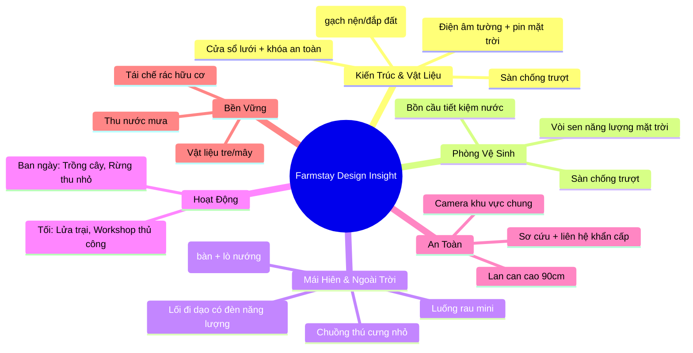

**Thiết kế Farmstay Đơn Giản cho Gia Đình với Trẻ Nhỏ**

### **Tổng quan mục tiêu:**  
Xây dựng một không gian gần gũi thiên nhiên, an toàn và thoải mái cho gia đình có trẻ nhỏ trải nghiệm trong 2 ngày 1 đêm. Sử dụng vật liệu đất tự nhiên, tập trung vào sự đơn giản và tính bền vững.

---

### **Kiến trúc & Vật Liệu**
1. **Cấu trúc chính**:  
   - **Nhà đất** (gạch nện hoặc đắp đất) cách nhiệt tốt, kích thước khoảng 35–45 m² bao gồm:  
     - 1 phòng ngủ mở (kết hợp khu vực sinh hoạt).  
     - Phòng vệ sinh riêng.  
     - Mái hiên rộng (~15 m²) nối liền với không gian ngoài trời.  

2. **An toàn**:  
   - Cửa sổ lưới chống muỗi + khóa an toàn; góc tường bo tròn.  
   - Sàn gỗ/nhám chống trượt; lan can cao 90cm ở mái hiên.  
   - Hệ thống điện âm tường, ổ cắm có nắp đậy.  

3. **Tiện nghi**:  
   - Giường thấp + nệm êm, ghế sofa nhỏ/góc đọc sách.  
   - Quạt trần, cửa sổ lớn đón gió tự nhiên, hệ thống pin mặt trời chiếu sáng.  
   - Kho đồ dùng gia đình (cốc tre, túi vải, đèn pin).

---

### **Phòng Vệ Sinh Thân Thiện**
- Bồn cầu tiết kiệm nước; bồn rửa 2 chiều cao (cho cả trẻ em).  
- Tấm lát chống trượt, vòi sen nước nóng từ năng lượng mặt trời.  
- Chiếu sáng tự nhiên qua ô thoáng kính mờ.  

---

### **Mái Hiên & Không Gian Ngoài Trời**
- **Khu vực mái hiên**:  
  - Ghế gỗ/bập bênh, xích đu/võng.  
  - Bàn ăn nhỏ + lò nướng than mini.  
- **Trải nghiệm thiên nhiên**:  
  - Luống rau mini để thu hoạch cùng bé (xà lách, cà chua).  
  - Chuồng thú cưng nhỏ (thỏ, gà).  
  - Lối đi dạo với đèn năng lượng mặt trời, ghế nghỉ dưới tán cây.  

---

### **Hoạt động Trải Nghiệm**  
1. **Ban ngày**:  
   - Tham quan trang trại, học cách trồng cơ bản.  
   - Chơi tự do ở khu vực **"Rừng Thu Nhỏ"** (cầu thăng bằng gỗ, hố cát, suối nhân tạo an toàn).  
2. **Buổi tối**:  
   - Lửa trại kể chuyện, quan sát sao.  
   - Workshop làm đồ thủ công (vẽ lá, nặn đất sét).  

---

### **Chi Tiết An Toàn**  
- Cẩm nang hướng dẫn sơ cứu + số điện thoại khẩn cấp.  
- Camera an ninh tại khu vực chung (không xâm phạm riêng tư).  
- Dịch vụ hỗ trợ đưa đón từ nhà chính đến farmstay.  

---

### **Yếu Tố Bền Vững**  
- Thu nước mưa tưới cây.  
- Tái chế rác hữu cơ thành phân bón.  
- Decor từ tre, mây, vải bố.  

--- 

**Hiệu ứng mong đợi:**  
Gia đình được thư giãn, con trẻ khám phá thiên nhiên mà vẫn đảm bảo yếu tố an toàn và tiện nghi cơ bản.

Dưới đây là sơ đồ Mermaid tóm tắt insight về thiết kế farmstay theo yêu cầu của bạn:

**Giải thích**:  
Sơ đồ tập trung vào 6 trụ cột chính để đáp ứng mục tiêu:  
1. **Kiến trúc** tối giản nhưng an toàn với trẻ nhỏ  
2. **Trải nghiệm đa dạng** kết hợp học hỏi và giải trí  
3. **Tính bền vững** xuyên suốt từ vật liệu đến vận hành  
4. **Tương tác thiên nhiên** qua không gian ngoài trời  
5. **Tiện nghi cơ bản** không làm mất chất "hoang sơ"  
6. **Quản lý rủi ro** chủ động cho gia đình có trẻ em

---
### Đánh giá của ChatGPT:
Dưới đây là phân tích và đánh giá chi tiết về ý tưởng **Farmstay Đơn Giản cho Gia Đình với Trẻ Nhỏ**:

---

## 1. **Tính Tổng Quan và Định Hướng Ý Tưởng**

- **Mục tiêu rõ ràng:**  
  Ý tưởng hướng đến việc tạo ra một không gian gần gũi với thiên nhiên, an toàn và tiện nghi cho gia đình có trẻ nhỏ, đồng thời kết hợp trải nghiệm học hỏi và giải trí. Điều này giúp định vị rõ ràng đối tượng khách hàng và mục tiêu sử dụng.

- **Sự cân bằng giữa "hoang sơ" và tiện nghi:**  
  Việc thiết kế nhằm giữ được chất “hoang sơ” nhưng vẫn đảm bảo tiện nghi cơ bản cho cả người lớn và trẻ nhỏ là điểm nhấn độc đáo, giúp khách hàng cảm thấy thoải mái nhưng vẫn có trải nghiệm khác biệt so với những khu nghỉ dưỡng hiện đại quá tinh vi.

---

## 2. **Kiến Trúc & Vật Liệu**

- **Sử dụng vật liệu tự nhiên:**  
  Việc ứng dụng gạch nện hoặc đắp đất không chỉ giúp cách nhiệt mà còn tạo sự kết nối với thiên nhiên. Đây là điểm mạnh về tính bền vững và thân thiện môi trường.

- **Thiết kế đơn giản, hợp lý:**  
  - Diện tích khoảng 35–45 m² với một phòng ngủ mở kết hợp sinh hoạt phù hợp cho gia đình nhỏ.  
  - Mái hiên rộng (~15 m²) tạo không gian liên thông giữa trong nhà và ngoài trời, tạo cảm giác rộng rãi và gần gũi thiên nhiên.

- **Tiêu chuẩn an toàn cho trẻ nhỏ:**  
  Các giải pháp như cửa sổ lưới chống muỗi, khóa an toàn, góc tường bo tròn, sàn chống trượt, lan can cao 90cm… cho thấy sự quan tâm đặc biệt đến an toàn, giảm thiểu rủi ro cho trẻ.

- **Giải pháp năng lượng và tiện nghi:**  
  Hệ thống điện âm tường, ổ cắm có nắp đậy cùng việc sử dụng pin mặt trời cho chiếu sáng là những giải pháp hiện đại và tiết kiệm năng lượng, phù hợp với xu hướng bền vững.

---

## 3. **Phòng Vệ Sinh Thân Thiện**

- **Tiện ích phù hợp cho trẻ em và người lớn:**  
  Bồn cầu tiết kiệm nước, bồn rửa 2 chiều cao và tấm lát chống trượt cho thấy sự tỉ mỉ trong thiết kế tiện nghi cho cả trẻ nhỏ và người lớn.

- **Tích hợp năng lượng mặt trời:**  
  Vòi sen nước nóng từ năng lượng mặt trời không chỉ giúp tiết kiệm năng lượng mà còn góp phần giảm thiểu chi phí vận hành lâu dài.

---

## 4. **Mái Hiên & Không Gian Ngoài Trời**

- **Không gian sinh hoạt đa chức năng:**  
  Mái hiên với ghế gỗ, bập bênh, xích đu/võng, bàn ăn và lò nướng than mini tạo nên một không gian lý tưởng cho các hoạt động gia đình và tạo cảm giác thân mật, gắn kết.

- **Kết nối với thiên nhiên:**  
  - Luống rau mini và chuồng thú cưng nhỏ giúp khách hàng, đặc biệt là trẻ em, có cơ hội tiếp xúc và học hỏi về tự nhiên.  
  - Lối đi dạo có đèn năng lượng mặt trời và ghế nghỉ dưới tán cây tạo nên một trải nghiệm thư giãn sau những giờ làm việc căng thẳng.

---

## 5. **Hoạt Động Trải Nghiệm**

- **Hoạt động đa dạng và tương tác:**  
  Các hoạt động ban ngày (tham quan trang trại, chơi tại "Rừng Thu Nhỏ") và buổi tối (lửa trại, workshop thủ công) không chỉ tạo nên sự phong phú mà còn thúc đẩy sự sáng tạo và giao lưu giữa các thành viên gia đình.

- **Giá trị giáo dục:**  
  Việc tích hợp các hoạt động học hỏi như trồng cây và làm đồ thủ công giúp trẻ em phát triển kỹ năng và kiến thức về thiên nhiên, môi trường sống bền vững.

---

## 6. **Yếu Tố An Toàn và Hỗ Trợ Khẩn Cấp**

- **An toàn được đặt lên hàng đầu:**  
  Sự kết hợp giữa cơ sở hạ tầng an toàn (camera giám sát khu vực chung, lan can an toàn, thiết kế cửa sổ và sàn phù hợp) và việc chuẩn bị cẩm nang sơ cứu cùng số điện thoại khẩn cấp đảm bảo sự yên tâm cho các gia đình khi sử dụng dịch vụ.

- **Dịch vụ hỗ trợ đưa đón:**  
  Dịch vụ đưa đón từ nhà chính đến farmstay giúp giải quyết các vấn đề về giao thông, đặc biệt hữu ích với các gia đình có trẻ nhỏ.

---

## 7. **Yếu Tố Bền Vững**

- **Quản lý tài nguyên:**  
  - Việc thu nước mưa và tái chế rác hữu cơ thành phân bón thể hiện cam kết về bảo vệ môi trường và sử dụng tài nguyên một cách hiệu quả.  
  - Sử dụng decor từ tre, mây, vải bố không chỉ mang tính thẩm mỹ mà còn giúp giảm thiểu tác động môi trường so với các vật liệu nhân tạo.

---

## 8. **Sơ Đồ Tư Duy (Mermaid Mindmap)**

- **Tóm tắt trực quan:**  
  Sơ đồ Mermaid giúp tóm tắt các yếu tố cốt lõi của thiết kế, từ kiến trúc, tiện nghi, an toàn đến trải nghiệm và bền vững, tạo nên cái nhìn tổng thể dễ hiểu và có tính hệ thống.

---

## **Đánh Giá Chung**

### **Điểm Mạnh:**

- **Thiết kế thân thiện với gia đình và trẻ nhỏ:**  
  Mọi yếu tố từ kiến trúc đến tiện nghi đều được thiết kế để đảm bảo an toàn, tạo sự thoải mái và kích thích sự tò mò, sáng tạo của trẻ.

- **Tính bền vững và sử dụng năng lượng hiệu quả:**  
  Việc tích hợp các giải pháp năng lượng mặt trời, thu nước mưa và tái chế rác hữu cơ giúp giảm tác động tiêu cực đến môi trường.

- **Sự kết hợp hài hòa giữa trải nghiệm thiên nhiên và tiện nghi hiện đại:**  
  Không gian sống gần gũi với thiên nhiên nhưng vẫn đảm bảo các tiện ích cơ bản giúp khách hàng vừa có trải nghiệm mộc mạc, vừa không thiếu các điều kiện sống hiện đại.

- **Đa dạng hoạt động trải nghiệm:**  
  Các hoạt động được lên kế hoạch đa dạng, vừa mang tính giải trí, vừa có tính giáo dục, tạo nên trải nghiệm toàn diện cho cả gia đình.

### **Điểm Cần Cải Thiện/Chú Ý:**

- **Quy mô và chi phí:**  
  Mặc dù ý tưởng hướng đến sự đơn giản, nhưng việc sử dụng vật liệu tự nhiên và tích hợp các hệ thống an toàn, năng lượng mặt trời có thể đòi hỏi đầu tư ban đầu khá lớn. Cần có kế hoạch tài chính cụ thể và nghiên cứu thị trường để đảm bảo chi phí hợp lý và hiệu quả kinh doanh.

- **Quản lý và vận hành:**  
  Việc đảm bảo chất lượng dịch vụ, an toàn 24/7 và duy trì cơ sở hạ tầng bền vững đòi hỏi một đội ngũ quản lý chuyên nghiệp. Cần lên kế hoạch đào tạo và quy trình vận hành chi tiết.

- **Phù hợp với mọi mùa trong năm:**  
  Ý tưởng cần có thêm các giải pháp đối phó với điều kiện thời tiết khác nhau (mưa, nắng, lạnh) để đảm bảo sự an toàn và thoải mái cho khách hàng trong mọi điều kiện.

---

## **Kết Luận**

Ý tưởng **Farmstay Đơn Giản cho Gia Đình với Trẻ Nhỏ** có nhiều ưu điểm nổi bật với sự kết hợp giữa trải nghiệm thiên nhiên, yếu tố giáo dục và tiêu chuẩn an toàn cao. Việc ứng dụng các giải pháp bền vững và sử dụng vật liệu tự nhiên tạo nên một sản phẩm có giá trị môi trường và phù hợp với xu hướng hiện nay.

Tuy nhiên, để triển khai thành công, cần chú trọng đến khâu quản lý chi phí, vận hành và điều chỉnh thiết kế sao cho phù hợp với điều kiện thực tế và mùa vụ. Nếu được đầu tư và quản lý tốt, dự án có thể trở thành một điểm đến lý tưởng cho các gia đình tìm kiếm trải nghiệm nghỉ dưỡng gần gũi thiên nhiên nhưng vẫn đảm bảo tiện nghi hiện đại.

--- 

Nhìn chung, ý tưởng là một hướng đi sáng tạo và có tiềm năng lớn, đặc biệt trong bối cảnh nhu cầu trải nghiệm du lịch xanh và bền vững ngày càng tăng.