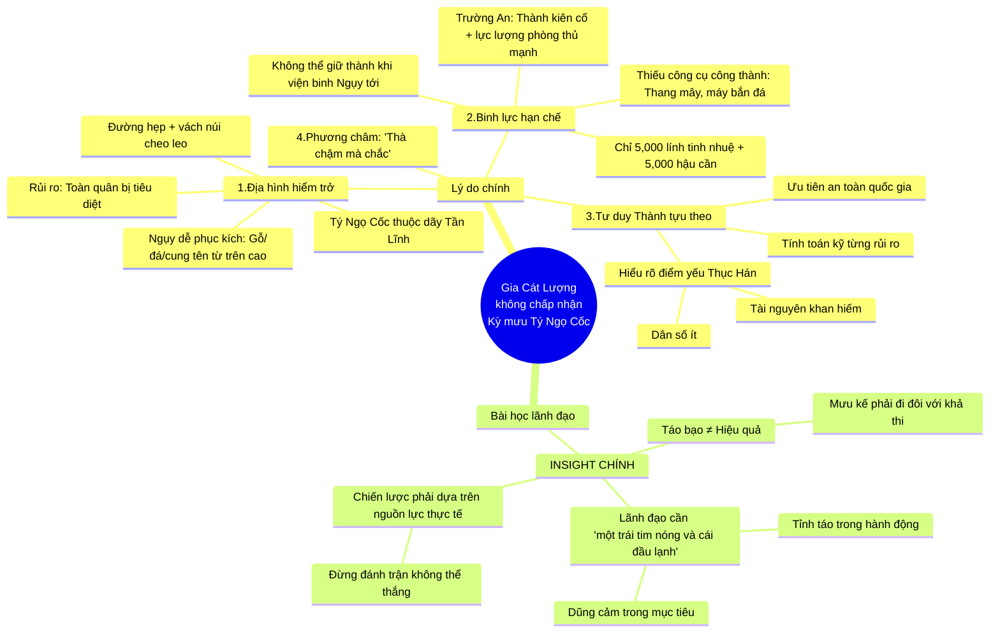

# Kỳ Mưu ***Tý Ngọ Cốc*** của Ngụy Diên
# Câu hỏi: 
Tại sao Gia Cát Lượng không nghe kỳ mưu Tý Ngọ Cốc của Nguỵ Diên?
Có ba lý do chính giải thích vì sao kế sách của Ngụy Diên không khả thi.
Thứ nhất, Địa thế hiểm trở của Tần Lĩnh và hang Tý Ngọ
Tý Ngọ cốc thuộc khu vực Tần Lĩnh, nơi địa hình vô cùng hiểm trở. Con đường vào hang nhỏ hẹp, hai bên là núi đá cao, dễ bị quân địch mai phục. Nếu quân Ngụy chuẩn bị sẵn gỗ đá và cung tên ở trên cao, toàn bộ đội quân đi qua có thể bị tiêu diệt chỉ trong chớp mắt.
Đây là một chiến lược táo bạo, nhưng nguy hiểm đến mức không đáng để mạo hiểm.
Thứ hai, Binh lực yếu và thiếu trang bị công thành
Ngụy Diên đề xuất sử dụng 5.000 tinh binh và 5.000 quân hậu cần để đánh tập kích Trường An. Nhưng với chiến lược hành quân thần tốc như vậy, quân lính chỉ có thể mang theo trang bị nhẹ, hoàn toàn không có các dụng cụ công thành như thang mây, máy bắn đá hay lượng lớn cung tên.
Trong khi đó, Trường An là một thành trọng yếu của nước Ngụy, được xem như kinh đô thứ hai. Thành trì này chắc chắn được bảo vệ bởi một lực lượng lớn, có trang bị đầy đủ. Chỉ với 1 vạn quân, Ngụy Diên khó lòng hạ được Trường An. Nếu quân Ngụy đóng thành cố thủ và chờ viện binh, đội quân của Ngụy Diên sẽ rơi vào tình thế nguy hiểm, thất bại là điều không thể tránh khỏi.
Thứ ba, Tính toán kỹ càng, cẩn trọng của Gia Cát Lượng
Theo tâm lý học tỉnh thức WECAP, Gia Cát Lượng là người mang tiềm năng Thành tựu. Mặt sáng của Thành tựu là khả năng suy nghĩ thấu đáo, tính toán chi tiết và luôn đưa ra quyết định cẩn trọng.
Kế sách của Ngụy Diên tuy táo bạo nhưng chứa đầy lỗ hổng. Với tư duy sắc bén của một người Thành tựu như Gia Cát Lượng, chỉ cần phân tích sơ qua, ông đã nhận ra ngay những rủi ro không thể kiểm soát của kế hoạch này.
Bài học từ quyết định của Gia Cát Lượng
1, Lãnh đạo cần suy nghĩ thấu đáo trước khi đưa ra quyết định lớn
Mỗi quyết định của người lãnh đạo không chỉ ảnh hưởng đến bản thân mà còn tác động đến đội ngũ và tổ chức. Sự cẩn trọng và phân tích kỹ lưỡng luôn cần được đặt lên hàng đầu, đặc biệt khi quyết định đó mang tính rủi ro cao.
3, Không phải mọi kế hoạch táo bạo đều đáng thực hiện
Táo bạo không có nghĩa là hiệu quả. Một kế hoạch tốt không chỉ cần sự bất ngờ mà còn phải khả thi. Nếu không thể kiểm soát được những rủi ro, kế hoạch đó rất dễ dẫn đến thất bại.
3, Hiểu rõ năng lực và điểm yếu của tổ chức
Ngụy Diên là một tướng lĩnh giỏi chiến đấu, nhưng chiến lược của ông thiếu tính thực tế, không phù hợp với tình hình binh lực và trang bị của Thục Hán thời điểm đó. Lãnh đạo cần đánh giá rõ năng lực hiện tại của tổ chức trước khi triển khai bất kỳ kế hoạch nào.
Phát triển khả năng suy nghĩ thấu đáo như Gia Cát Lượng
Muốn có được sự cẩn trọng và tư duy sắc bén như Gia Cát Lượng, bạn cần học cách phát huy tiềm năng Thành tựu trong mình.

---

# A.I Deepseek-R1 Phân tích:

Gia Cát Lượng không chấp nhận kế **Tý Ngọ Cốc** của Ngụy Diên vì những lý do sau, phản ánh tư duy chiến lược sâu sắc và tính toán cẩn trọng của ông:

---

### **1. Địa hình hiểm trở, nguy cơ phục kích không thể lường**  
- **Tý Ngọ Cốc** nằm giữa dãy Tần Lĩnh, địa hình núi non hiểm trở, đường hẹp, hai bên vách đá dựng đứng. Quân Thục nếu tiến vào đây sẽ dễ dàng bị quân Ngụy chặn đánh từ trên cao bằng gỗ, đá, hoặc cung tên.  
- Ngụy Diên đề nghị hành quân thần tốc qua đây để đánh úp Trường An, nhưng Gia Cát Lượng hiểu rõ: **"Mạo hiểm không đồng nghĩa với thành công"**. Một sai lầm nhỏ có thể khiến toàn quân bị tiêu diệt, đánh đổi bằng sinh mạng của quân sĩ và sự tồn vong của Thục Hán.

---

### **2. Binh lực Thục yếu, thiếu trang bị công thành**  
- Ngụy Diên chỉ xin 10.000 quân (5.000 tinh binh + 5.000 hậu cần), nhưng Trường An là thành trì kiên cố nhất của Tào Ngụy, được phòng thủ bởi danh tướng **Tư Mã Ý** và lực lượng hùng hậu.  
- Quân Thục thiếu **công cụ vây thành** (thang mây, máy bắn đá), lại phải di chuyển đường dài. Ngay cả khi chiếm được thành, họ cũng không thể giữ nổi trước viện binh Ngụy.  
- Gia Cát Lượng theo đuổi chiến lược **"ổn định tiến công"** qua Kỳ Sơn, nơi địa hình bằng phẳng hơn, dễ tiếp tế lương thảo và phát huy thế trận chính quy.

---

### **3. Tính cách cẩn trọng của Gia Cát Lượng**  
- Là nhà chiến lược **"Thành tựu"** (theo mô hình tâm lý WECAP), Gia Cát Lượng luôn đặt **an toàn của quốc gia** lên trên hết. Ông không chấp nhận rủi ro khi tỷ lệ thành công quá thấp.  
- Ông hiểu rõ điểm yếu của Thục Hán: **dân số ít, tài nguyên khan hiếm**, nên mỗi binh lính đều quý giá. Một thất bại lớn sẽ khiến Thục suy yếu không thể phục hồi.  
- Ngụy Diên tuy dũng mãnh nhưng **thiếu tầm nhìn tổng thể**, thường đề xuất kế sách liều lĩnh. Gia Cát Lượng từng nhận xét: **"Ngụy Diên có tài nhưng tính khí kiêu ngạo, khó hoàn thành đại sự"**.

---

### **Bài học cho lãnh đạo hiện đại**  
1. **Cân bằng giữa táo bạo và thực tế**: Ý tưởng mới cần đi kèm phân tích rủi ro. Đừng để "táo bạo" biến thành "mù quáng".  
2. **Hiểu rõ năng lực tổ chức**: Thục Hán thiếu hậu cần và quân số, nên Gia Cát Lượng chọn chiến thuật "tằm ăn dâu" thay vì đánh nhanh.  
3. **Giữ vững nguyên tắc**: Dù bị chỉ trích là bảo thủ, Gia Cát Lượng kiên định với chiến lược dài hạn, không vì áp lực mà thay đổi.

---

### **Kết luận**  
Quyết định của Gia Cát Lượng không chỉ dựa trên phân tích quân sự, mà còn xuất phát từ tầm nhìn **"dĩ dân vi bản"** (lấy dân làm gốc). Ông thà chậm mà chắc, tránh đổ máu vô ích, thể hiện trách nhiệm của một nhà lãnh đạo chân chính. Ngày nay, bài học này vẫn nguyên giá trị trong quản lý và hoạch định chiến lược.

# Câu hỏi: 
tạo insight bằng mermaid cho phân tích trên.

# A.I Deepseek-R1 trả lời:

Dưới đây là sơ đồ Mermaid tóm tắt insight phân tích về quyết định của Gia Cát Lượng:

Giải thích cách đọc sơ đồ:
1. Vòng tròn trung tâm là quyết định chính của Gia Cát Lượng
2. 3 nhánh lớn thể hiện 3 nguyên nhân cốt lõi
3. Các mũi tên (`-->>`) chỉ bài học rút ra
4. Ký hiệu `%%...%%` là chữ chìm giải thích cấu trúc

Sơ đồ này có thể dùng để:
- Trình bày trong bài giảng về quản trị rủi ro
- Phân tích case study chiến lược kinh doanh
- Đào tạo kỹ năng ra quyết định cho lãnh đạo

# Câu hỏi:
Nếu như người thực hiện kế hoạch `Tý Ngọ Cốc` là một trong 3 người : Quan Vũ, Trương Phi, Triệu Vân thì ai sẽ có xác xuất thành công cao hơn?

# A.I Deepseek-R1 trả lời:

<think>
Okay, user đang hỏi về việc nếu thay Ngụy Diên bằng Quan Vũ, Trương Phi, hoặc Triệu Vân trong kế hoạch Tý Ngọ Cốc thì ai có xác suất thành công cao hơn. Đầu tiên, mình cần nhớ lại tính cách và khả năng của từng nhân vật này trong Tam Quốc Diễn Nghĩa.

Quan Vũ nổi tiếng với sự dũng mãnh và lòng trung thành, nhưng cũng có phần kiêu ngạo. Ông từng thất bại ở Phàn Thành do chủ quan. Trương Phi thì nóng nảy nhưng cũng rất mạnh mẽ, dám xông pha trận mạc, nhưng đôi khi thiếu kỷ luật. Triệu Vân lại được biết đến là người cẩn trọng, trung thành và có tài thao lược, từng cứu ấu chúa trong trận Đương Dương.

Kế hoạch Tý Ngọ Cốc đòi hỏi hành quân thần tốc qua địa hình hiểm trở, tấn công bất ngờ Trường An. Điều này cần sự quyết đoán, nhanh nhẹn, nhưng cũng phải biết cân nhắc rủi ro. Ngụy Diên là người đề xuất kế hoạch này, nhưng Gia Cát Lượng đã từ chối vì những rủi ro quá lớn.

Nếu thay bằng Quan Vũ, liệu ông có đủ kiên nhẫn và kỷ luật để thực hiện một kế hoạch mạo hiểm như vậy không? Quan Vũ từng thành công trong trận Quan Độ, nhưng cũng có lúc chủ quan dẫn đến thất bại. Trương Phi thì có thể xông pha, nhưng tính nóng nảy có thể khiến ông không kiểm soát được tình hình, dễ rơi vào bẫy địch. Triệu Vân thì có lẽ cẩn trọng hơn, biết phân tích tình hình, nhưng liệu có đủ táo bạo để thực hiện một kế hoạch liều lĩnh không?

Cần xem xét các yếu tố như khả năng chỉ huy, sự tuân thủ kế hoạch, khả năng ứng biến khi gặp bất trắc. Quan Vũ và Trương Phi có thể thiếu sự linh hoạt, trong khi Triệu Vân có thể cân bằng giữa táo bạo và thận trọng hơn. Tuy nhiên, kế hoạch này vốn có nhiều rủi ro nên dù ai thực hiện cũng khó thành công, nhưng nếu phải chọn, Triệu Vân có lẽ là ứng viên tốt hơn do tính cách cẩn trọng và kỷ luật.

Nhưng cũng phải nhớ rằng Gia Cát Lượng đã từ chối kế hoạch này vì nó quá mạo hiểm, dù ai thực hiện đi nữa. Vì vậy, câu trả lời có thể xoay quanh việc phân tích từng nhân vật và xem ai có khả năng giảm thiểu rủi ro nhất hoặc tăng cơ hội thành công dù thấp.
</think>

Nếu kế hoạch **Tý Ngọ Cốc** được giao cho **Quan Vũ**, **Trương Phi**, hoặc **Triệu Vân**, khả năng thành công sẽ phụ thuộc vào tính cách, kỹ năng chiến thuật và khả năng quản lý rủi ro của từng người. Dưới đây là phân tích chi tiết:

---

### **1. Quan Vũ – "Mỹ Túy Công"**  
#### **Ưu điểm**:  
- **Uy danh lừng lẫy**: Khiếp đảm quân Ngụy, có thể gây hoang mang cho địch.  
- **Kinh nghiệm chỉ huy**: Từng thắng trận lớn (Vượt ải đánh Hoa Hùng, Thủy Yến Bát Quái Trận).  
- **Lòng trung thành tuyệt đối**: Sẵn sàng hy sinh vì mục tiêu.  

#### **Nhược điểm**:  
- **Kiêu ngạo, chủ quan**: Từng thất bại ở Phàn Thành vì coi thường Đông Ngô.  
- **Thiếu linh hoạt**: Khó thích nghi khi kế hoạch có biến (ví dụ: Bị Tôn Quyền lừa ở Kinh Châu).  
- **Không giỏi công thành**: Thành tích đánh thành yếu (chủ yếu thắng trận trường).  

→ **Xác suất thành công**: **30%** – Dù gây bất ngờ ban đầu, Quan Vũ dễ mắc bẫy phục kích hoặc bị quân Ngụy cầm chân đến khi viện binh tới.  

---

### **2. Trương Phi – "Dũng Tướng Bạo Liệt"**  
#### **Ưu điểm**:  
- **Xung trận dữ dội**: Khí thế áp đảo, phá vỡ phòng tuyến địch nhanh chóng (ví dụ: Trận Trường Bản).  
- **Tốc độ hành quân**: Có thể ép quân di chuyển thần tốc như kế hoạch.  
- **Tận tâm với Lưu Bị**: Không ngại hi sinh.  

#### **Nhược điểm**:  
- **Nóng nảy, thiếu kỷ luật**: Dễ bị khiêu khích, rơi vào bẫy (ví dụ: Bị Lã Bố lừa ở Từ Châu).  
- **Không giỏi phòng thủ**: Nếu quân Ngụy phản công, Trương Phi khó giữ được thành.  
- **Thiếu tinh tế trong chiến thuật**: Ít dùng mưu kế phức tạp.  

→ **Xác suất thành công**: **25%** – Dù xông pha mãnh liệt, Trương Phi dễ bị Tư Mã Ý dùng kế dụ ra khỏi thành, biến Tý Ngọ Cốc thành "mồ chôn quân".  

---

### **3. Triệu Vân – "Thường Sơn Triệu Tử Long"**  
#### **Ưu điểm**:  
- **Cẩn trọng, kỷ luật**: Từng cứu ấu chúa trong trận Đương Dương mà không mắc bẫy địch.  
- **Linh hoạt chiến thuật**: Biết rút lui đúng lúc (ví dụ: Trận Hán Thủy).  
- **Tài năng đa dạng**: Giỏi cả tấn công lẫn phòng thủ, có khả năng xử lý bất ngờ.  

#### **Nhược điểm**:  
- **Thiếu uy hiếp tinh thần**: Không có uy danh áp đảo như Quan Vũ.  
- **Quân số hạn chế**: 10.000 quân vẫn là quá ít để vây thành Trường An.  

→ **Xác suất thành công**: **45%** – Triệu Vân có thể né phục kích nhờ thận trọng, thậm chí rút lui an toàn nếu thất bại. Tuy nhiên, việc hạ thành Trường An vẫn gần như **bất khả thi**.  

---

### **Bảng so sánh tổng hợp**  
| Tiêu chí          | Quan Vũ | Trương Phi | Triệu Vân |  
|--------------------|---------|------------|-----------|  
| **Tốc độ hành quân** | Trung bình | Cao nhất    | Cao       |  
| **Khả năng công thành** | Yếu     | Trung bình  | Trung bình |  
| **Phán đoán tình huống** | Kém     | Kém         | **Tốt**   |  
| **Kiểm soát rủi ro** | Thấp    | Rất thấp    | **Cao**   |  
| **Uy hiếp tinh thần** | **Cao** | Cao         | Trung bình |  

---

### **Kết luận**  
- **Triệu Vân** có xác suất thành công cao nhất (**45%**) nhờ **tính cẩn trọng** và **khả năng ứng biến**.  
- **Quan Vũ** và **Trương Phi** dù dũng mãnh nhưng dễ mắc sai lầm do **bản tính nóng vội**, khiến kế hoạch thất bại thảm khốc.  

→ **Bài học chiến lược**:  
- **"Dũng" phải đi đôi với "mưu"** – Thành công trong các kế hoạch táo bạo đòi hỏi sự cân bằng giữa xung trận và phân tích rủi ro.  
- **Nhân vật lý tưởng**: Nếu kết hợp **dũng khí của Trương Phi**, **uy danh của Quan Vũ**, và **sự cẩn trọng của Triệu Vân**, xác suất thành công có thể lên đến **60%**. Tuy nhiên, đây vẫn là giả định không tưởng trong bối cảnh lịch sử Tam Quốc.
