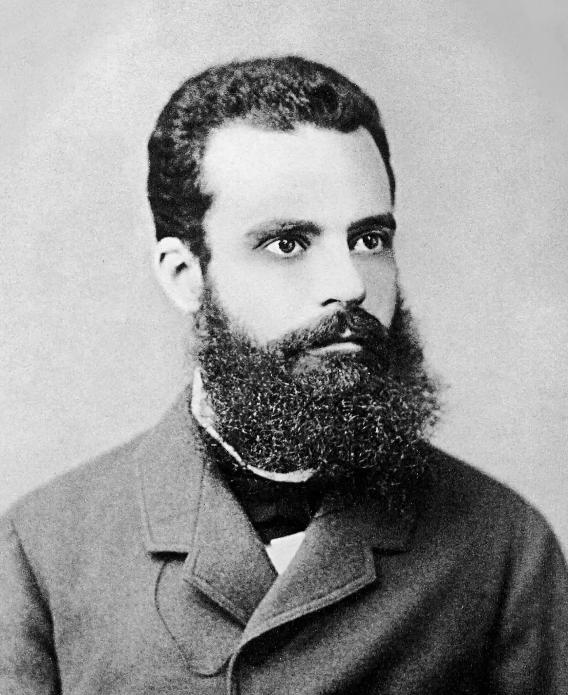
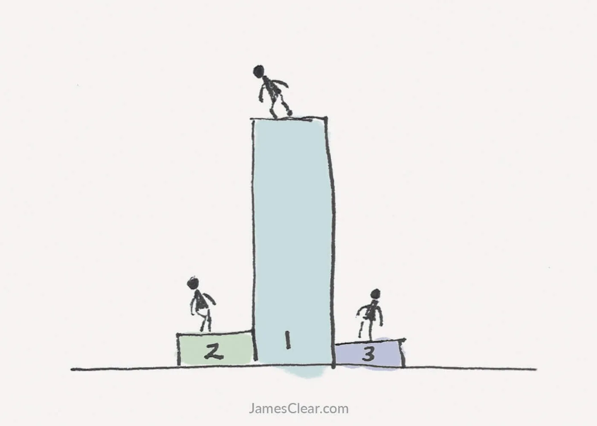

# Sức Mạnh Của Lợi Thế Tích Lũy

Vào cuối những năm 1800 – không ai biết chính xác thời điểm – người đàn ông tên Vilfredo Pareto đã khám phá ra một điều thú vị nho nhỏ trong khu vườn của mình. Pareto nhận thấy rằng một phần nhỏ số cây đậu trong vườn cho ra phần lớn các hạt đậu.

Pareto là nghiên cứu sinh toán học. Ông là nhà kinh tế học và một trong những di sản của ông là chuyển kinh tế học thành môn khoa học gắn liền với những con số và lập luận khô khan. Không giống nhiều nhà kinh tế học khác cùng thời, các bài viết và sách của Pareto đầy những công thức. Và những hạt đậu trong vườn đã kích thích bộ não toán học của ông vận động.

Sẽ ra sao nếu sự phân chia không đều này cũng xuất hiện ở các lĩnh vực khác trong cuộc sống?

#### Nguyên Lý Pareto
Lúc đó, Pareto đang nghiên cứu sự giàu có ở nhiều quốc gia khác nhau. Vì là người Ý, ông bắt đầu bằng việc phân tích sự phân chia tài sản ở nước Ý. Ông ngạc nhiên khi phát hiện rằng 20% dân số ở Ý nắm giữ xấp xỉ 80% đất đai. Tương tự như những cây đậu trong vườn của ông, một phần nhỏ dân số kiểm soát phần lớn các nguồn lực.

Pareto tiếp tục phân tích những quốc gia khác và bắt đầu nhận ra một xu hướng. Đa số phần thưởng dường như luôn đổ dồn về một phần trăm nhỏ dân số. Ý tưởng một phần nhỏ hành động dẫn đến phần lớn kết quả được biết đến là Nguyên Lý Pareto, hoặc phổ biến hơn là Nguyên Tắc 80/20.

#### Không Nơi Nào Đồng Đều
Trong những thập kỷ sau, nghiên cứu của Pareto gần như trở thành chân lý đối với các nhà kinh tế, và Nguyên Tắc 80/20 giờ đây trở nên phổ biến hơn bao giờ hết.

Ví dụ, thông qua giải bóng rổ nhà nghề Mỹ (NBA) mùa giải 2015-2016, 20% số đội giành 75,3% chức vô địch. Hơn nữa, chỉ 2 đội – Boston Celtics và Los Angeles Lakers – giành gần một nửa tổng số chức vô địch trong lịch sử của NBA. Những con số thậm chí còn rõ ràng hơn trong môn bóng đá. Mặc dù 77 quốc gia khác nhau tranh tài ở World Cup, nhưng 3 quốc gia Brazil, Đức, và Ý giành được 13 chiến thắng trên tổng số 20 lần diễn ra World Cup.

Những ví dụ về Nguyên Lý Pareto xuất hiện ở mọi lĩnh vực. Tại sao điều này xảy ra? Tại sao một số ít người và tổ chức lại có được phần lớn phần thưởng trong cuộc sống? Để trả lời câu hỏi này, hãy xem xét một ví dụ từ tự nhiên.

Sức Mạnh Của Lợi Thế Tích Lũy
Date: November 29, 2018
Author: phandinhdieu
0 Comments
Sức Mạnh Của Lợi Thế Tích Lũy

Image result for matthew effect
Vào cuối những năm 1800 – không ai biết chính xác thời điểm – người đàn ông tên Vilfredo Pareto đã khám phá ra một điều thú vị nho nhỏ trong khu vườn của mình. Pareto nhận thấy rằng một phần nhỏ số cây đậu trong vườn cho ra phần lớn các hạt đậu.

Pareto là nghiên cứu sinh toán học. Ông là nhà kinh tế học và một trong những di sản của ông là chuyển kinh tế học thành môn khoa học gắn liền với những con số và lập luận khô khan. Không giống nhiều nhà kinh tế học khác cùng thời, các bài viết và sách của Pareto đầy những công thức. Và những hạt đậu trong vườn đã kích thích bộ não toán học của ông vận động.

Sẽ ra sao nếu sự phân chia không đều này cũng xuất hiện ở các lĩnh vực khác trong cuộc sống?

Nguyên Lý Pareto
Lúc đó, Pareto đang nghiên cứu sự giàu có ở nhiều quốc gia khác nhau. Vì là người Ý, ông bắt đầu bằng việc phân tích sự phân chia tài sản ở nước Ý. Ông ngạc nhiên khi phát hiện rằng 20% dân số ở Ý nắm giữ xấp xỉ 80% đất đai. Tương tự như những cây đậu trong vườn của ông, một phần nhỏ dân số kiểm soát phần lớn các nguồn lực.

Pareto tiếp tục phân tích những quốc gia khác và bắt đầu nhận ra một xu hướng. Đa số phần thưởng dường như luôn đổ dồn về một phần trăm nhỏ dân số. Ý tưởng một phần nhỏ hành động dẫn đến phần lớn kết quả được biết đến là Nguyên Lý Pareto, hoặc phổ biến hơn là Nguyên Tắc 80/20.

Không Nơi Nào Đồng Đều
Trong những thập kỷ sau, nghiên cứu của Pareto gần như trở thành chân lý đối với các nhà kinh tế, và Nguyên Tắc 80/20 giờ đây trở nên phổ biến hơn bao giờ hết.

Ví dụ, thông qua giải bóng rổ nhà nghề Mỹ (NBA) mùa giải 2015-2016, 20% số đội giành 75,3% chức vô địch. Hơn nữa, chỉ 2 đội – Boston Celtics và Los Angeles Lakers – giành gần một nửa tổng số chức vô địch trong lịch sử của NBA. Những con số thậm chí còn rõ ràng hơn trong môn bóng đá. Mặc dù 77 quốc gia khác nhau tranh tài ở World Cup, nhưng 3 quốc gia Brazil, Đức, và Ý giành được 13 chiến thắng trên tổng số 20 lần diễn ra World Cup.

Những ví dụ về Nguyên Lý Pareto xuất hiện ở mọi lĩnh vực. Tại sao điều này xảy ra? Tại sao một số ít người và tổ chức lại có được phần lớn phần thưởng trong cuộc sống? Để trả lời câu hỏi này, hãy xem xét một ví dụ từ tự nhiên.

#### Sức Mạnh Của Lợi Thế Tích Lũy
Rừng nhiệt đới Amazon là một trong những hệ sinh thái đa dạng nhất trên Trái đất. Các nhà khoa học ghi nhận có khoảng 16.000 loài cây khác nhau ở Amazon. Nhưng mặc cho mức đa dạng đáng kể này, các nhà nghiên cứu phát hiện rằng có khoảng 227 loài “vô cùng vượt trội” chiếm gần một nửa diện tích rừng, 1,4% loài cây chiếm 50% số lượng cây ở Amazon.

Nhưng tại sao?

Hãy tưởng tượng hai cây phát triển cạnh nhau. Mỗi ngày cả hai sẽ cạnh tranh giành lấy ánh sáng và đất. Nếu cây này lớn nhanh hơn cây kia dù chỉ một chút, thì nó có thể mọc cao hơn, đón được nhiều ánh nắng hơn và tiếp xúc với mưa nhiều hơn. Ngày tiếp theo, sự chêch lệch năng lượng này giúp cây phát triển nhanh hơn. Xu hướng này tiếp diễn cho đến khi cây này khỏe mạnh hơn hẳn cây kia và chiếm phần ánh sáng, đất và những chất dinh dưỡng tốt nhất. Từ vị thế này, cây chiến thắng có khả năng sinh sôi tốt hơn, giúp cho loài này mở rộng diện tích phát triển ở thế hệ tiếp theo. Quy trình này lặp đi lặp lại đến khi nó thống trị toàn bộ khu rừng.

Các nhà khoa học xem kết quả này là “lợi thế tích lũy.” Lợi thế bắt đầu ở mức nhỏ rồi lớn dần theo thời gian. Một cây chỉ cần một lợi thế nhỏ lúc đầu để vượt xa đối thủ và xâm chiếm toàn bộ khu rừng.

#### Hiệu Ứng “Người Thắng Có Tất Cả”
Điều tương tự cũng xảy ra trong cuộc sống của chúng ta.

Giống như cây trong rừng nhiệt đới, con người thường cạnh tranh những nguồn lực giống nhau. Các chính trị gia cạnh tranh số phiếu bầu. Nhà văn cạnh tranh vị trí những cuốn sách bán chạy nhất. Các vận động viên cạnh tranh huy chương vàng. Các công ty cạnh tranh khách hàng tiềm năng. Các chương trình truyền hình cùng cạnh tranh thời lượng xem đài của bạn.

Sự khác biệt giữa những lựa chọn này có thể là rất nhỏ, nhưng người chiến thắng có được hầu hết những phần thưởng rất lớn.

Hãy tưởng tượng hai vận động viên nữ thi bơi ở Olympic. Một trong số họ có thể bơi nhanh hơn người kia 1/100 giây, nhưng cô ấy giành tất cả huy chương vàng. Mười công ty có thể nhắm đến một khách hàng tiềm năng, nhưng chỉ một trong số họ sẽ ký được dự án. Hoặc có lẽ bạn đang ứng tuyển một công việc mới. Hai trăm ứng viên có thể cạnh tranh một vị trí, nhưng chỉ cần nổi bật hơn các ứng viên khác một chút cũng giúp bạn nhận được công việc. Trong những tình huống đòi hỏi sự so sánh tương đối, khi thành tích là yếu tố quyết định cho thành công của bạn, bạn chỉ cần nhỉnh hơn đối thủ một chút để nắm bắt tất cả phần thưởng.

#### “Người Thắng Có Tất Cả” Dẫn Đến “Người Thắng Có Phần Lớn”
Hiệu Ứng Người Thắng Có Tất Cả trong các cuộc cạnh tranh cá nhân có thể dẫn đễn Hiệu Ứng Người Thắng Có Phần Lớn trong cuộc chơi lớn hơn của cuộc sống.

Từ vị thế này – với huy chương vàng trong tay hoặc tiền mặt trong ngân hàng – người chiến thắng bắt đầu quá trình tích lũy những lợi thế giúp họ dẫn đầu dễ dàng hơn trong lần cạnh tranh tiếp theo, khi kết quả lại lần nữa thể hiện Nguyên Tắc 80/20.

Nếu một con đường thuận lợi giao thương hơn một con đường khác, nhiều người sẽ qua lại trên con đường đó hơn và nhiều hoạt động kinh doanh sẽ xuất hiện ở đây. Khi nhiều doanh nghiệp ra đời, mọi người có thêm những lý do để đi lại và thế là con đường tiếp tục trở nên nhộn nhịp hơn nữa.

Ranh giới giữa tốt và tuyệt vời hẹp hơn vẻ ngoài của nó.

Việc chiến thắng một vòng đua giúp ta nâng cao lợi thế chiến thắng ở những vòng đua tiếp theo. Mỗi vòng đua tăng thêm sẽ củng cố hơn nữa vị thế của những người dẫn dầu.

Theo thời gian, những người “tốt hơn một chút” sẽ giành được phần lớn phần thưởng. Ý tưởng này đôi khi được gọi là Hiệu Ứng Matthew, bắt nguồn từ một đoạn trong Kinh Thánh:

“Những ai đã có sẽ có thêm, và sẽ có rất nhiều; những ai không có gì thậm chí sẽ còn bị lấy đi những gì mình có.”

Nguyên Tắc 1%
Những khác biệt nhỏ trong thành tích có thể dẫn đến những phân chia thiếu đồng đều được lặp lại theo thời gian. Đây cũng là một lý do tại sao thói quen lại vô cùng quan trọng. Những cá nhân và tổ chức nào có thể làm điều đúng đắn một cách kiên định hơn thường sẽ duy trì được các lợi thế nhỏ và tích lũy phần chênh lệch theo thời gian.

Chúng ta có thể gọi đây là Nguyên Tắc 1%: Theo thời gian, phần lớn phần thưởng trong một lĩnh vực sẽ dồn về số ít những người hoặc tổ chức duy trì được 1% lợi thế so với đối thủ.

Tác giả: James Clear
Nguồn: http://jamesclear.com/the-1-percent-rule
Dịch: Ubrand.cool