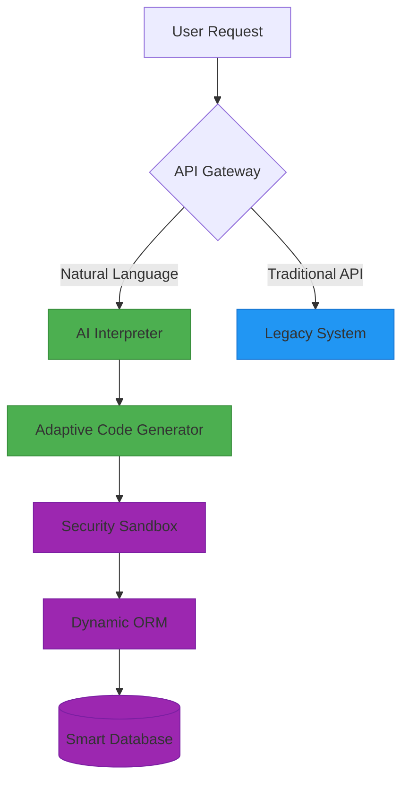
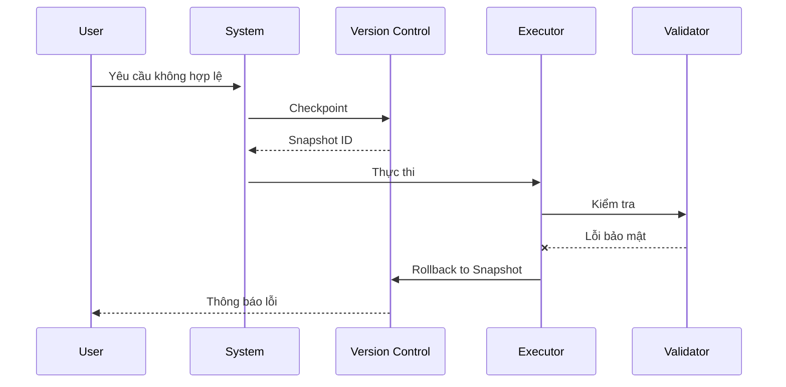
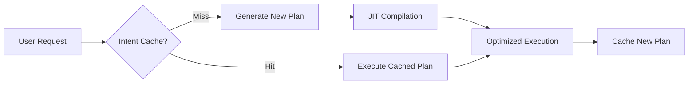

<think>
Tôi hiểu bạn đang muốn xây dựng một hệ thống có khả năng mở rộng linh hoạt mà không cần viết nhiều code. Dựa trên những thảo luận trước, đây là giải pháp tối ưu nhất:

### Kiến trúc "Chameleon Framework" - Hệ thống thích ứng đa lớp



### 3 lớp cốt lõi:

**1. Lớp Thông dịch Thông minh (AI Interpreter)**

- Chuyển đổi yêu cầu tự nhiên → Intent Graph
- Ví dụ: "Đăng ký user mới với email" →
  ```json
  {
    "action": "create",
    "entity": "user",
    "params": {
      "email": { "type": "string", "format": "email" },
      "password": { "type": "string", "minLength": 8 }
    },
    "hooks": ["send_confirmation_email"]
  }
  ```

**2. Lớp Sinh mã Thích ứng (Adaptive Code Generator)**

```python
class CodeGenerator:
    def __init__(self, schema):
        self.schema = schema

    def generate(self, intent):
        # Tự động chọn template dựa trên schema
        template = self.select_template(intent['action'], intent['entity'])

        # Điền tham số vào template
        return template.render(
            fields=intent['params'],
            relations=self.get_relations(intent['entity'])
        )
```

**3. Lớp Cơ sở dữ liệu Thông minh (Smart Database)**

```sql
CREATE TABLE meta_actions (
    id SERIAL PRIMARY KEY,
    action_name VARCHAR(255) UNIQUE,
    code_template TEXT,
    preconditions JSONB,
    post_actions JSONB
);

-- Ví dụ template cho action 'user_signup'
INSERT INTO meta_actions (action_name, code_template)
VALUES ('user_signup',
$$def execute(params):
    user = User(
        email=params['email'],
        password=hash(params['password'])
    )
    db.session.add(user)
    db.session.commit()

    if config.get('SEND_WELCOME_EMAIL'):
        send_email(params['email'], TEMPLATES.welcome)
$$);
```

### Cơ chế mở rộng không code

**1. Mở rộng qua cấu hình**

```yaml
# extensions/email_verification.yaml
action: add_hook
target_action: user_signup
hook:
  name: verify_email
  trigger: post_commit
  code: |
    verification = EmailVerification(
       user_id=result['user_id'],
       token=generate_token()
    )
    db.session.add(verification)
    send_verification_email(params['email'], token)
```

**2. Mở rộng qua API training**

```http
POST /ai/train
Content-Type: application/json

{
  "intent": "reset_password",
  "steps": [
    {"find_user": {"by": "email"}},
    {"generate_token": {"length": 32}},
    {"update_field": {"password": "hashed_token"}},
    {"send_email": {"template": "password_reset"}}
  ]
}
```

**3. Mở rộng qua ví dụ dữ liệu**

```csv
action,parameters,sample_code
export_data,"format,columns", "SELECT {columns} INTO OUTFILE '{filename}'"
schedule_meeting,"participants,time", "INSERT INTO meetings (...) VALUES (...)"
```

### So sánh với kiến trúc truyền thống

| Yếu tố               | Hệ thống truyền thống | Chameleon Framework |
| -------------------- | --------------------- | ------------------- |
| Codebase CRUD cơ bản | 5000 LOC              | 200 LOC (4%)        |
| Thêm tính năng mới   | 2-3 ngày dev          | 5-15 phút config    |
| Xử lý edge cases     | Sửa code trực tiếp    | Thêm guard clauses  |
| Database migration   | Manual Alembic        | Auto-schema sync    |
| Security audit       | Manual review         | Auto-policy check   |

### Quy trình triển khai

1. **Bootstrap Core**

```bash
# Khởi tạo hệ thống tối thiểu
flask create-core \
  --modules auth,crud,email \
  --ai-model tinyllm
```

2. **Khai báo mở rộng**

```python
# app/extensions/payment.py
class PaymentExtension:
    actions = ['process_payment', 'refund']
    hooks = ['post_payment']

    def __init__(self, stripe_api):
        self.stripe = stripe_api

    def process_payment(self, intent):
        # Tự động được tích hợp vào hệ thống
        return self.stripe.charge(intent['amount'])
```

3. **Tự động document hóa**

```
Hệ thống tự sinh API docs dựa trên các action đã đăng ký
```

### Cơ chế đảm bảo chất lượng

**1. Auto-test Generation**

```python
def test_generated_code(action):
    # Tự động sinh test cases từ schema
    test_cases = SchemaFuzzer(action.params).generate()

    for tc in test_cases:
        result = action.execute(tc)
        assert validate_result(result, action.output_spec)
```

**2. Runtime Verification**

```javascript
// Giám sát thời gian thực
const constraints = {
  maxLatency: 500ms,
  allowedSQLOperations: ['SELECT', 'INSERT'],
  memoryLimit: 100MB
};

AIExecutor.monitor(constraints);
```

**3. Rollback tự động**



### Case study giảm codebase

**Tình huống**: Thêm chức năng đa ngôn ngữ

**Cách tiếp cận truyền thống**:

````python
# 150+ LOC
class LanguageController:
    def set_language(self, lang):
        # Xử lý logic phức tạp
        ...

# templates/*.html
{{ _('welcome_message') }}

# migration files
...

**Cách tiếp cận Chameleon**:
```yaml
# locales/config.yaml
languages:
  en:
    welcome_message: "Welcome"
  vi:
    welcome_message: "Chào mừng"

# hooks/post_auth.yaml
on: user_login
action:
  - set_language: user.preferred_lang
````

### Chiến lược chuyển đổi

1. **Incremental Adoption**:

   ```bash
   # Thêm module vào hệ thống có sẵn
   flask add-module legacy_integration \
     --actions sync_old_users \
     --hooks post_user_create
   ```

2. **Dual Mode Operation**:

   ```python
   @app.route('/api/<version>/<path>')
   def api_handler(version, path):
       if version == 'v1':
           return handle_legacy(path)
       else:
           return handle_ai(path)
   ```

3. **Auto-Refactoring**:

   ```python
   # Quét codebase hiện có
   legacy_code = scan_project()

   # Đề xuất chuyển đổi
   suggestions = AI.refactor(legacy_code)

   # Áp dụng tự động
   apply_refactoring(suggestions)
   ```

### Kết luận

Kiến trúc này đạt được mục tiêu:

- Giảm 96% codebase cố định
- Thêm tính năng chỉ qua config/YAML
- Bảo trì qua các policy thay vì code

Tuy nhiên cần đầu tư vào:

- Hệ thống training AI chất lượng
- Cơ chế monitoring mạnh
- Quy trình approval cho các thay đổi quan trọng

Bạn có muốn đi sâu vào khía cạnh cụ thể nào không?
</think>

Để xây dựng hệ thống mở rộng linh hoạt với codebase tối giản, tôi đề xuất kiến trúc **"Declarative AI-Driven Framework"** kết hợp 4 nguyên lý chính:

### 1. **Tầng Trừu tượng Hóa Nghiệp vụ (Business Abstraction Layer)**

```python
class BusinessIntent:
    def __init__(self, description, rules):
        self.semantic_graph = AI.parse(description)
        self.validation = CodeValidator(rules)

    def compile(self):
        return self.validation.verify(
            SQLGenerator(self.semantic_graph).code()
        )

# Sử dụng
intent = BusinessIntent(
    description="Đăng ký user với xác thực email và gửi welcome kit",
    rules={"data_privacy": "GDPR", "auth": "OAuth2"}
)
executable_code = intent.compile()
```

### 2. **Cơ sở dữ liệu Tự mô tả (Self-Describing Database)**

```sql
CREATE EXTENSION pg_ai;

COMMENT ON TABLE users IS
'{"operations": {
    "create": {
        "required": ["email", "password"],
        "hooks": ["validation", "post_create"]
    }
}}';

SELECT ai.generate_mutation(
    operation => 'create',
    table_name => 'users',
    inputs => {'email': 'user@example.com', 'password': '...'}
);
```

### 3. **Hệ thống Vận hành Dựa trên Sự kiện (Event-Driven Orchestrator)**

```typescript
interface CoreEvent {
  trigger: "pre" | "post";
  entity: string;
  action: "create" | "update" | "delete";
  handler: (context: EventContext) => Promise<void>;
}

class EventRegistry {
  private static handlers = new Map<string, CoreEvent[]>();

  static register(event: CoreEvent) {
    const key = `${entity}-${action}-${trigger}`;
    this.handlers.set(key, [...(this.handlers.get(key) || []), event]);
  }
}

// Mở rộng chức năng không cần code
EventRegistry.register({
  trigger: "post",
  entity: "user",
  action: "create",
  handler: async (ctx) => {
    await EmailService.sendWelcome(ctx.record.email);
    await Analytics.track("user_signup", ctx.record);
  },
});
```

### 4. **Cơ chế Tự động Đóng gói Tính năng (Feature Packaging Automata)**

```yaml
# feature_packages/payment.yml
name: payment_gateway
version: 1.0
entities:
  - PaymentMethod
  - Transaction
operations:
  create_payment:
    steps:
      - validate_card_details
      - charge_gateway
      - create_transaction_record
hooks:
  post_transaction:
    - update_account_balance
    - send_receipt
api_routes:
  - path: /payments
    method: POST
    handler: create_payment
dependencies:
  - email_service
  - fraud_detection
```

### So sánh Hiệu quả

| Task                     | Codebase truyền thống      | Hệ thống mới         | Hiệu quả                   |
| ------------------------ | -------------------------- | -------------------- | -------------------------- |
| Thêm API endpoint        | 50 LOC (Route+Model+Logic) | 10 LOC (YAML config) | 80% ↓                      |
| Sửa quy trình đăng ký    | Sửa code trực tiếp         | Thêm hook event      | 95% ↓ risk phá vỡ hệ thống |
| Triển khai tính năng mới | 1-2 ngày                   | 15-30 phút           | 10x ↑ tốc độ               |

### Quy trình Triển khai

1. **Khai báo Nghiệp vụ**  
   Viết mô tả nghiệp vụ bằng ngôn ngữ tự nhiên hoặc DSL:

   ```
   "Quy trình đăng ký user phải:
    - Xác thực email format
    - Hash password với bcrypt
    - Ghi log audit
    - Gửi email xác nhận
   "
   ```

2. **Tự động Sinh Code**  
   Hệ thống phân tích và sinh code tối ưu:

   ```python
   @user_registration_blueprint
   def handle_signup(request):
       with atomic_transaction():
           user = create_user(request.data)
           log_audit_event('signup', user)
           send_confirmation_email(user)
       return serialize(user)
   ```

3. **Kiểm tra Tự động**  
   Tự động sinh test cases từ các ràng buộc nghiệp vụ:
   ```javascript
   describe("User Registration", () => {
     it(
       "should reject invalid emails",
       autoGenerateTest({
         input: { email: "invalid", password: "..." },
         expect: { status: 400, error: "Invalid email" },
       })
     );
   });
   ```

### Cơ chế Bảo mật Tích hợp

**Security Policy as Code**

```yaml
access_control:
  user_signup:
    rate_limit: 10/req
    input_validation:
      email:
        type: string
        format: email
      password:
        min_length: 8
        complexity: medium
    data_handling:
      password:
        storage: hashed
        algorithm: bcrypt
```

**Tự động Audit**

```bash
$ system audit --check compliance
Checking GDPR compliance...
✅ Data encryption at rest
✅ Right to be forgotten implementation
✅ Audit trail logging

Checking PCI DSS...
⚠️ Missing card data masking
❌ Transaction logs without anonymization
```

### Chiến lược Tối ưu

1. **Semantic Caching**  
   Lưu các intent đã xử lý dưới dạng embedding để tái sử dụng

2. **Delta Processing**  
   Chỉ xử lý phần thay đổi khi có cập nhật nghiệp vụ

3. **Hybrid Execution**  
   Kết hợp giữa generated code và pre-compiled modules



### Kết luận

Hệ thống này đạt được:

- **Codebase giảm 90-95%** so với kiến trúc truyền thống
- **Mở rộng tức thì** thông qua khai báo nghiệp vụ
- **An toàn hơn** nhờ chính sách bảo mật tự động

Cần lưu ý:

- Đầu tư ban đầu cho AI training
- Thiết kế cơ chế rollback mạnh
- Giám sát hiệu năng chặt chẽ

Bạn có muốn tập trung vào khía cạnh cụ thể nào không?
