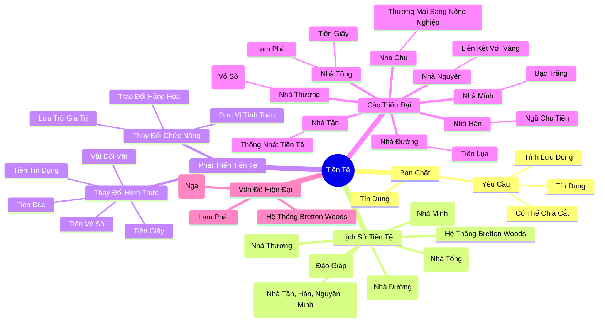

# Lịch Sử Tiền Tệ

---

## Mục Lục

1. **[Bản Chất và Yêu Cầu của Tiền Tệ](#bản-chất-và-yêu-cầu-của-tiền-tệ)**
2. **[Bản Chất của Tiền Tệ](#bản-chất-của-tiền-tệ)**
3. **[Tiền Đá trên Đảo Giáp](#tiền-đá-trên-đảo-giáp)**
4. **[Lịch Sử Tiền Tệ](#lịch-sử-tiền-tệ)**
5. **[Tiền Giấy ở Việt Nam và Trung Quốc](#tiền-giấy-ở-việt-nam-và-trung-quốc)**
6. **[Bối Tệ: Tiền Vỏ Sò Thời Nhà Thương](#bối-tệ-tiền-vỏ-sò-thời-nhà-thương)**
7. **[Sự Suy Tàn của Triều Thương](#sự-suy-tàn-của-triều-thương)**
8. **[Sự Thay Đổi từ Thương Mại Sang Nông Nghiệp](#sự-thay-đổi-từ-thương-mại-sang-nông-nghiệp)**
9. **[Giao Dịch Thời Nhà Chu](#giao-dịch-thời-nhà-chu)**
10. **[Giao Dịch Thời Xuân Thu](#giao-dịch-thời-xuân-thu)**
11. **[Tiền Tệ Thời Nhà Chu và Chiến Quốc](#tiền-tệ-thời-nhà-chu-và-chiến-quốc)**
12. **[Hình Dạng Tiền Tệ Thời Chiến Quốc](#hình-dạng-tiền-tệ-thời-chiến-quốc)**
13. **[Tiền Tệ Thời Nhà Tần](#tiền-tệ-thời-nhà-tần)**
14. **[Tiền Tệ Thời Nhà Hán](#tiền-tệ-thời-nhà-hán)**
15. **[Ngũ Chu Tiền](#ngũ-chu-tiền)**
16. **[Lương Quan Chức Thời Hán](#lương-quan-chức-thời-hán)**
17. **[Tiền Tệ Thời Nhà Đường](#tiền-tệ-thời-nhà-đường)**
18. **[Tiền Lụa Thời Nhà Đường](#tiền-lụa-thời-nhà-đường)**
19. **[Tiền Giấy Thời Nhà Tống](#tiền-giấy-thời-nhà-tống)**
20. **[Thương Mại Phát Triển Thời Tống](#thương-mại-phát-triển-thời-tống)**
21. **[Sự Ra Đời Của Tiền Giấy](#sự-ra-đời-của-tiền-giấy)**
22. **[Cơ Chế Tín Dụng của Giao Tử](#cơ-chế-tín-dụng-của-giao-tử)**
23. **[Vấn Đề Tín Dụng của Giao Tử](#vấn-đề-tín-dụng-của-giao-tử)**
24. **[Chính Phủ Đảm Bảo Tín Dụng](#chính-phủ-đảm-bảo-tín-dụng)**
25. **[Lạm Phát Thời Tống](#lạm-phát-thời-tống)**
26. **[Hậu Quả của Lạm Phát](#hậu-quả-của-lạm-phát)**
27. **[Tiền Tệ Thời Nhà Nguyên](#tiền-tệ-thời-nhà-nguyên)**
28. **[Tiền Tệ Thời Nhà Minh](#tiền-tệ-thời-nhà-minh)**
29. **[Liên Kết Đồng Rúp Với Vàng và Hệ Thống Bretton Woods](#liên-kết-đồng-rúp-với-vàng-và-hệ-thống-bretton-woods)**

---

## **Bản Chất và Yêu Cầu của Tiền Tệ**

Hiện nay, tiền tệ chủ yếu mà chúng ta sử dụng là **tiền giấy**. Nhưng trước đây, tiền tệ có lúc là **vỏ sò**, có lúc là **lụa**, vân vân. Thậm chí, ở một hòn đảo ở Tây Thái Bình Dương – **đảo Giáp** – người ta đã sử dụng đá làm tiền tệ. Có khối đá cao hơn 3 m, nặng gần 5 tấn. Người ta hay nói “tiền tệ, tiền tệ” – vậy thì bản chất của tiền tệ là gì? Yêu cầu đối với tiền tệ lại như thế nào?

---

## **Bản Chất của Tiền Tệ**

Bản chất của tiền tệ là **tín dụng**. Ví dụ, khi tôi đi mua đồ ở cửa hàng do người quen mở, mà tôi lại không mang theo tiền, tôi sẽ nói:

> *“Hôm nay tôi không mang tiền, tôi có thể đem đồ về; ngày mai tôi đem tiền trả.”*

Tại sao tôi có thể làm như vậy? Bởi vì tôi có **tín dụng** đối với người kia – nghĩa là sự tin tưởng (tiếng Anh: *Credit*). Tín dụng của tôi được đánh giá tương xứng với giá trị của món đồ.

Khi sử dụng thẻ tín dụng, ngân hàng phải kiểm tra về thu nhập, công việc… nhằm đảm bảo người dùng có khả năng trả nợ. Vì thẻ tín dụng là “xài trước, trả sau”, chỉ có khả năng trả nợ mới giúp ngân hàng tránh được tình trạng nợ xấu.

Trong xã hội “người qua đường” – chẳng hạn như khi tôi đi siêu thị Walmart, nơi tôi không có tín dụng từ người lạ – tôi không thể “mượn” hàng hóa như vậy. Vậy nên, chỉ cần có một thứ mà mọi người công nhận là có tín dụng, thứ đó đã có thể trở thành tiền tệ được sử dụng trong cộng đồng chung.

Ví dụ, nếu mọi người đều tin vào Bitcoin, thì Bitcoin có thể trở thành tiền tệ trong cộng đồng người tin vào nó. Ngược lại, nếu có người không tin, họ sẽ không chấp nhận khi bạn trả bằng Bitcoin. Như vậy, sự đồng thuận về giá trị của một thứ chính là yếu tố quyết định để thứ đó trở thành tiền tệ.

---

## **Tiền Đá trên Đảo Giáp**

Có một hòn đảo ở Tây Thái Bình Dương – đảo Giáp – nổi bật bởi loại tiền tệ kỳ lạ là **tiền đá**. Tiền đá ở đây có đường kính từ 7 cm đến 3,6 m, nặng tới 5 tấn. Vào khoảng năm 2000 trước Công Nguyên, tức cách đây hơn 4000 năm, đảo chỉ có khoảng 10.000 người sinh sống, và họ sử dụng tảng đá lớn làm tiền tệ.

Người ngoài nhìn vào khối đá khó mà biết được giá trị thực của nó, nhưng người dân đảo lại vô cùng tin tưởng sức mua của từng viên đá. Số lượng đá mà mỗi người nắm giữ tượng trưng cho lượng tài sản mà họ sở hữu.

Có một gia đình từng có tảng đá rất to, chất lượng tốt. Tuy nhiên, trong quá trình vận chuyển về đảo Giáp, tảng đá gặp gió bão và bị chìm dưới đại dương. Dù không còn thấy tảng đá ấy, nhưng người dân đảo vẫn tin rằng nó vẫn tồn tại dưới biển; từ đó, họ vẫn đánh giá gia đình đó có tài sản tương ứng.

Nếu tảng đá trở thành tiền tệ, sẽ xuất hiện một vấn đề: **tính lưu động** của tiền đá rất kém. Tiền tệ cần có tính lưu động để dễ dàng chuyển tay từ người này sang người khác. Vì vậy, trên đảo Giáp, người dân đã khắc chữ lên đá ghi rõ ngày tháng năm chuyển giao của tảng đá – tương tự như hệ thống **blockchain** hiện nay, cho phép truy xuất lịch sử giao dịch của tiền đá.

Do tính lưu động hạn chế, tiền đá trên đảo Giáp không thích hợp cho giao dịch số lượng lớn. Chính vì vậy, tiền tệ phải đáp ứng được ba yêu cầu cơ bản:

1. **Tín dụng:** Mọi người tin tưởng vào giá trị của nó.
2. **Tính lưu động:** Dễ dàng chuyển giao giữa các cá nhân.
3. **Có thể chia cắt được:** Không giống như heo, bò – vì bạn không thể chia cắt chúng ra để giao dịch mà vẫn đảm bảo được tính sống.

---

## **Lịch Sử Tiền Tệ**

Trên đây, chúng ta đã nói về bản chất và yêu cầu của tiền tệ. Vậy lịch sử tiền tệ ra sao? Lịch sử tiền tệ bắt đầu từ những năm 2000 ở châu Âu khi thống nhất tiền tệ và Ngân hàng Trung ương Châu Âu phát hành đồng Euro. Tuy nhiên, đã từ thời nhà Tần (cách đây 2200 năm) Tần Thủy Hoàng đã thống nhất tiền tệ.

FED được thành lập năm 1913, được coi là Ngân hàng Trung ương của Mỹ, gồm 12 ngân hàng dự trữ địa phương. Trước đó, vào thời nhà Tống (khoảng những năm 1000), đã xuất hiện cơ cấu tương tự như Ngân hàng Trung ương, khi 16 gia đình phú hộ triệu Tống phát hành tiền giấy. Sau này, hệ thống FED trở nên thành thục và phát triển hơn.

---

## **Tiền Giấy ở Việt Nam và Trung Quốc**

Ở Việt Nam, tiền giấy mới được phát hành vào thời nhà Hồ (sau thời nhà Trần, vào khoảng những năm 1400), vì vậy Trung Quốc phát hành tiền giấy sớm hơn Việt Nam khoảng 400 năm.

Trung Quốc còn có cơ cấu tài chính tương tự FED sớm hơn tới 900 năm, và thống nhất tiền tệ trước châu Âu 2200 năm – điều này thực sự đáng kinh ngạc. Nhờ vậy, lịch sử tiền tệ của Trung Quốc có nhiều bài học quý báu, mà ở đây chúng ta mượn để nói về tiền tệ và thương nhân.

---

## **Bối Tệ: Tiền Vỏ Sò Thời Nhà Thương**

Chúng ta biết rằng tiền tệ xuất hiện sớm nhất ở Trung Quốc là tiền **vỏ sò**, gọi là **bối tệ**. Loại tiền này được làm từ vỏ sò và được phát hiện với số lượng lớn vào thời nhà Thương.

Vương triều nhà Thương mang đậm nét thần bí, với sự chú trọng vào tế tự (tế lễ, thờ cúng) và chiêm mộc (bói toán). Mỗi khi có việc lớn như gieo hạt, săn bắn hay chiến tranh, họ đều muốn hỏi thần. Cách thức thực hiện là lấy mai rùa hoặc xương bò đem thiêu trong lửa; sau khi thiêu, các vết nứt được giải thích theo những hoa văn, từ đó cho ra kết quả chiêm bốc.

Những văn tự khắc trên mai rùa (quy giáp) hay trên xương thú (thú cốt) được gọi là **giáp cốt văn** – trong tiếng Anh là *oracle*. Trong tiếng Trung, “oracle” có nghĩa là **thần dụ**, tức là lời chỉ dẫn, khải thị của thần dành cho con người.

Triều Thương dường như có mối liên hệ mật thiết với các loại “quỷ thần”. Họ đã dời đô nhiều lần, cuối cùng định đô tại An Dương – phần phía Bắc của tỉnh Hà Nam, Trung Quốc.

---

## **Sự Suy Tàn của Triều Thương**

Ở An Dương, có di tích **Ân Khư** – nơi khai quật nhiều văn vật thờ nhà Thương. Trong mộ phần của người phụ nữ tên **Phụ Hảo** (nữ tướng, nữ chính trị gia sớm nhất được ghi chép bằng thanh văn khắc trên đồ đồng xanh), đã phát hiện hơn 6000 vỏ sò, chủ yếu là vỏ sò biển sâu và mai rùa mà triều Thương dùng để chiêm bốc.

Có một nhóm người từ bán đảo Malaysia cũng đã được tìm thấy, cho thấy kỹ thuật hàng hải của người nhà Thương thời đó vô cùng phát triển. Họ có thể đến vùng biển sâu để lấy vỏ sò, thậm chí đến Malaysia để bắt rùa.

Mặc dù triều Thương là một quốc gia nội địa với đô thị Đô Thành ở An Dương, kỹ thuật tạo thuyền và hàng hải của họ rất tiên tiến, nhằm mục đích khai thác vỏ sò – một vật liệu quý hiếm dùng làm tiền tệ.

---

## **Sự Thay Đổi từ Thương Mại Sang Nông Nghiệp**

Sau khi triều Thương diệt vong, triều Chu được thành lập với phương thức sinh hoạt mới. Triều Chu chủ yếu dựa vào nông nghiệp để lập quốc. Ban đầu, triều Chu thực hành chế độ **tỉnh điền**: tám gia đình chiếm hữu tám miếng đất, trung gian là ruộng chung để mọi người cùng canh tác, và sau vài năm lại hoán đổi.

Phương thức này dẫn đến việc trao đổi hàng hóa chủ yếu giữa các gia tộc, nên tiền tệ lúc đó dùng rất ít.

---

## **Giao Dịch Thời Nhà Chu**

Trong thời nhà Chu, người ta chủ yếu sử dụng phương thức lấy vật đổi vật. Ví dụ, trong **Thi Kinh** có câu:

> **“Bảo bố màu ty”**  
> *(抱布貿絲 – “ôm vải đổi lụa”)*

Thời kỳ đầu của chế độ tỉnh điền, phạm vi trao đổi hàng hóa giữa các gia tộc rất hạn chế – mỗi người chỉ trao đổi những sản phẩm sản xuất trên mảnh đất của mình, nên tiền tệ lưu thông rất ít.

---

## **Giao Dịch Thời Xuân Thu**

Tình trạng trao đổi hàng hóa bằng lấy vật đổi vật kéo dài cho đến thời Xuân Thu. Khi giao lưu giữa các quốc gia trở nên phức tạp, bao gồm việc hối lộ và kết giao giữa người với người, nếu không có tiền tệ thì họ vẫn dùng những vật có giá trị như ngọc hay ngựa tốt để trao đổi.  
Ví dụ, như câu chuyện về Đường Diệt Quắc: nước Ngô và nước Quắc bị nước Tấn lừa, mà nước Tấn hối lộ bằng ngọc và lụa cho quốc vương hai nước.

---

## **Tiền Tệ Thời Nhà Chu và Chiến Quốc**

Trong triều Chu, tiền tệ chủ yếu là tiền vỏ sò; do đó, tiền thật sự ít được sử dụng. Chỉ đến thời Chiến Quốc, khi nhu cầu buôn bán gia tăng, kỹ thuật đúc đồng sắc phát triển, nhiều quốc gia bắt đầu đúc tiền tệ cho riêng mình.

---

## **Hình Dạng Tiền Tệ Thời Chiến Quốc**

Hình dạng tiền tệ của mỗi nước có sự khác biệt: có đồng có hình tròn, có đồng có hình đao. Bên cạnh đó, ngoài tiền đúc, còn có tiền làm từ **hoàng kim** – thời đó hoàng kim chủ yếu là đồng thau. Đến cuối thời kỳ chư quốc, ta thường nghe nói “thưởng 1000 cân hoàng kim.”

---

## **Tiền Tệ Thời Nhà Tần**

Đến thời nhà Tần, Tần Thủy Hoàng đã thực hiện việc thống nhất tiền tệ, trong đó có việc thống nhất hình dạng tiền tệ. Ông phế bỏ hoàn toàn tiền tệ của các nước trước đó, và thống nhất thành hình **ngoại viên nội phương** – bên ngoài tròn, bên trong vuông, tượng trưng cho “trời tròn, đất vuông.” Từ đó, tiền xu Trung Quốc đều mang hình dạng này.

---

## **Tiền Tệ Thời Nhà Hán**

Tiền tệ do Tần Thủy Hoàng đúc lúc đó rất nặng. Một đồng nặng **bán lượng** – trong đó một lượng nặng 24 châu (một châu khoảng 2 đến 3 gam), nên bán lượng (12 châu) nặng khoảng 24 đến 36 gam. Đến thời Hán sơ, tiền tệ có một số thay đổi. Thời Hán kỳ lạ khi từ lúc Lưu Bang khai quốc đến khi Hán Vũ Đế thống nhất quyền đúc tiền của quốc gia kéo dài khoảng 70 đến 100 năm; trong thời gian đó, dân chúng thậm chí có thể tự đúc tiền.

---

## **Ngũ Chu Tiền**

Đến thời Hán Vũ Đế, đã có một thay đổi quan trọng: quyền đúc tiền được thu hồi về tay chính phủ. Tất cả tiền tệ đều được quốc gia thống nhất đúc, gọi là **ngũ chu tiền**. Tên gọi ngũ chu có nghĩa là mỗi bản đồng nặng năm châu – nhẹ hơn đồng tiền của nhà Tần (bán lượng – 12 châu). Ngũ chu tiền là loại tiền lưu thông dài nhất trong lịch sử Trung Quốc, kéo dài từ thời Hán Vũ Đế cho đến những năm đầu triều Đường, tức hơn 700 năm.

---

## **Lương Quan Chức Thời Hán**

Trên thực tế, từ thời kỳ Tần – Hán đến triều Ngụy Tấn, lương của các quan chức không phải là tiền mà là lương thực. Đến thời Đông Hán, lương được chi trả một nửa bằng lương thực, một nửa bằng tiền. Tình trạng này kéo dài đến thời Đông Tấn. Vào thời Tấn, có thi nhân **Đào Uyên Minh** từng nói:

> **“Đừng vì năm đấu gạo mà khom lưng.”**

(Trong đó, “đấu” là đơn vị đo thể tích, tương đương khoảng 10 lít.)

---

## **Tiền Tệ Thời Nhà Đường**

Đầu triều Tùy vẫn lưu hành ngũ chu tiền. Sau đó, phương thức đúc tiền có một số thay đổi. Trước thời nhà Đường, tất cả các đồng tiền đều có trọng lượng (ví dụ: tiền Tần là bán lượng, tiền Hán là ngũ chu). Nhưng đến thời nhà Đường, Đường Cao Tổ Lý Uyên đúc tiền mà không ghi trọng lượng, và đồng tiền này được gọi là **Khai Nguyên Thông Bảo**. Mặc dù “Khai Nguyên” là niên hiệu của Đường Huyền Tông, nhưng tên tiền thời Đường Cao Tổ vẫn là Khai Nguyên Thông Bảo.

---

## **Tiền Lụa Thời Nhà Đường**

Thời nhà Đường, tiền tệ giao dịch chủ yếu không phải là Khai Nguyên Thông Bảo mà là **lụa** hoặc **tơ lụa**. Khi hoàng đế ban thưởng cho ai đó, thường là thưởng bao nhiêu tấm lụa. Sau khi **Hoàng Sào** tác loạn, nhiều tấm lụa bị thiêu mất trong loạn lạc, nên có bài thơ thời **Ngũ Đại** viết:

> **“Nội khố thiêu vi cẩm tú hôi”**  
> *(Có nghĩa: “Trong kho, lụa cháy thành tro.”)*

Ở đây, “khố” ám chỉ **quốc khố**.

---

## **Tiền Giấy Thời Nhà Tống**

Đến thời nhà Tống, tiền tệ lại có những thay đổi. Lúc này, xuất hiện **tiền giấy** – bởi thương mại phát triển, không thể mang theo số tiền lớn khi giao dịch. Nhưng tiền giấy thời Tống cũng gặp một số trục trặc. Nếu hiểu rõ vấn đề này, chúng ta sẽ thấy rằng bản chất của tiền tệ là **tín dụng** – sự tin tưởng – và qua đó giải thích được ý nghĩa của **tiền tệ tín dụng có chủ quyền**.

---

## **Thương Mại Phát Triển Thời Tống**

Triều Tống là triều đại có **kinh tế phát triển nhất** trong xã hội truyền thống Trung Quốc. Thương mại phát triển vượt bậc, khi đó thu nhập quốc khố của triều Tống có tới **70%** đến từ khu vực thương nghiệp. Sự phát triển của thương nghiệp cũng thúc đẩy kỹ thuật tạo thuyền, từ đó tạo ra nhu cầu về một lượng tiền lớn. Lúc này, lượng **bạc trắng** của Trung Quốc không đủ đáp ứng.

---

## **Sự Ra Đời Của Tiền Giấy**

Vậy, triều Tống đã làm gì? Vì đồng đúc hay bạc đúc quá nặng, nên triều Tống đã nghĩ ra biện pháp **phát hành tiền giấy** – loại tiền giấy đầu tiên của Trung Quốc, và trên thế giới, gọi là **giao tử**. Đáng chú ý, đơn vị phát hành giao tử đầu tiên không phải là chính phủ mà là **16 đại hộ** (16 hộ lớn) ở Tứ Xuyên, liên kết lại với nhau để phát hành giao tử.

---

## **Cơ Chế Tín Dụng của Giao Tử**

Giao tử được đảm bảo bằng **tín dụng** của 16 đại hộ. Cách thức hoạt động như sau: bạn gửi **1000 quan tiền** vào chỗ họ, sau đó họ sẽ cấp cho bạn một tờ giấy cam kết rằng bạn đã gửi 1000 quan tiền. Tờ giấy này có thể dùng để giao dịch ở nơi khác, nơi bạn chỉ cần trình giấy để rút 1000 quan tiền từ chi nhánh của 16 đại hộ. Tờ giấy này tương tự như **thư tín dụng** (*Letter of Credit*).

---

## **Vấn Đề Tín Dụng của Giao Tử**

Tiền giấy này dựa vào tín dụng của **16 đại hộ** làm đảm bảo. Tuy nhiên, có một vấn đề nảy sinh: khi bạn gửi tiền ở chỗ họ và lấy tờ giao tử đi, số tiền đó sẽ được họ sử dụng để cho vay hoặc kinh doanh. Nếu họ thua lỗ hoặc phá sản, bạn sẽ không thể đổi lại số tiền đã gửi. Những sự cố như vậy sau đó đã thu hút sự can thiệp của triều đình.

---

## **Chính Phủ Đảm Bảo Tín Dụng**

Hoàng đế thời đó – **Tống Nhân Tông** – đã ra lệnh:

> *“Được rồi, không để cho người dân tự phát hành tiền; hãy để quan phủ làm việc này.”*

Từ đó, tín dụng của **chính phủ** được sử dụng để đảm bảo cho việc phát hành tiền giấy. Tiền giấy hiện nay như **đô la Mỹ**, **bảng Anh**, **nhân dân tệ**… đều lấy tín dụng của chính phủ làm đảm bảo, được gọi là **tiền tệ tín dụng có chủ quyền**.

---

## **Lạm Phát Thời Tống**

Vào những năm của hoàng đế **Tống Nhân Tông** (thời Bắc Tống), người ta đã bắt đầu phát hành tiền giấy dựa trên tín dụng của chính phủ. Tuy nhiên, khi chưa có khái niệm về **chuẩn bị kim** (lượng vàng dự trữ đảm bảo tiền giấy) và chưa biết chính xác lưu thông sản phẩm cần bao nhiêu tiền, đã dẫn đến việc in quá nhiều tiền, từ đó gây ra **lạm phát**.

---

## **Hậu Quả của Lạm Phát**

Chính phủ nhận ra rằng, chỉ cần có khả năng in tiền là có thể chi tiêu. Họ xây dựng công trình lớn, tiến hành chiến tranh, xây cung điện… nếu thiếu tiền thì in thêm tiền. Hậu quả là lạm phát bùng phát. Những năm cuối thời Bắc Tống và Nam Tống đều chứng kiến lạm phát nghiêm trọng, thậm chí, nước **Kim** trước khi diệt vong cũng gặp tình trạng này. Một số nhà kinh tế học nhận định rằng sự sụp đổ của các vương triều có liên quan mật thiết đến lạm phát.

---

## **Tiền Tệ Thời Nhà Nguyên**

Sau thời Nam Tống đến triều Nguyên, người Nguyên rất thông minh. Nguyên Thế Tổ **Hốt Tất Liệt** đã quy định rằng, đằng sau mỗi tờ tiền giấy phải có một lượng vàng dự trữ, giống như một kho bạc. Cụ thể, ông quy định: cứ mỗi hai lượng bạc trắng nộp vào quốc khố thì có thể phát hành tiền giấy hai Quang Năm Xu; và mỗi lần nhập quốc khố hai lượng vàng thì có thể phát hành tờ giấy bạc 20 Quang 500 Đồng.

Hốt Tất Liệt trị vì 35 năm, với quy định chế độ dự trữ vàng, nên những năm đầu triều Nguyên mặc dù có tiền giấy nhưng thực sự có vàng dự trữ – người dân có thể đổi tiền giấy lấy vàng hoặc bạc, đảm bảo sự ổn định của tiền tệ.

---

## **Tiền Tệ Thời Nhà Minh**

Đến triều Minh, tiền tệ lại có nhiều thay đổi. Lúc triều Minh bắt đầu chính là thời điểm kết thúc của thời kỳ trung cổ ở châu Âu. Năm 1453, đế quốc Ottoman (Thổ Nhĩ Kỳ) trỗi dậy, tấn công và chiếm được Constantinople – kinh đô của đế quốc Đông La Mã. Sự trỗi dậy của Ottoman đã tạo ra biến chuyển lớn trên toàn châu Âu, góp phần khởi đầu nghệ thuật Phục Hưng, sự ra đời của Cơ Đốc giáo Tin Lành, và thời đại Đại Hàng Hải.

Vào những năm Chính Đức của Hoàng Đế Minh Vũ Tông, do Đại Hàng Hải bùng nổ, thương mại giữa châu Âu, châu Mỹ và châu Phi phát triển rầm rộ. Châu Âu bắt đầu thuộc địa hóa các nước ở châu Mỹ – nơi sản xuất bạc với nhiều mỏ bạc. Có người thống kê rằng, Tây Ban Nha đã khai thác bạc ở Nam Mỹ đạt khoảng 100.000 đến 130.000 tấn, trong đó 80% được vận chuyển ra khỏi Nam Mỹ và 50% của số đó đưa vào Trung Quốc.

Với sự phát triển của giao thương, khi trao đổi với Trung Quốc – nơi có nhiều mặt hàng tốt như tơ lụa, trà… người ta dùng **bạc trắng** để thanh toán. Sau này, khi Đại Thần Trương Cư Chính đưa ra các cải cách, người dân buộc phải đóng thuế hoặc trả lương cho quan viên bằng bạc trắng, từ đó bạc trắng chính thức trở thành tiền tệ lưu thông chủ yếu ở Trung Quốc.

Đáng lưu ý, trong các tác phẩm điện ảnh khi nói “vào triều Đường, sau bữa ăn dùng bạc trả tiền” chỉ là sự giả tưởng; bạc trắng thực sự lưu thông rộng rãi chỉ từ trung – hậu kỳ triều Minh.

Tóm lại, đây là quá trình phát triển của tiền tệ:

- Ban đầu là **vỏ sò, biển sâu** (Triều Thương).
- Sau đó, **lấy vật đổi vật** (Triều Chu).
- Đến thời Xuân Thu, dùng **ngọc, ngựa** để hối lộ hoặc kết giao.
- Thời Chiến Quốc, bắt đầu đúc tiền.
- Thời Tần, thống nhất hình dạng tiền với **ngoại viên nội phương** (ngoài tròn, trong vuông).
- Thời Hán, quyền đúc tiền tập trung vào chính phủ.
- Đầu triều Đường, phát hành **Khai Nguyên Thông Bảo** nhưng tiền tệ chính giao dịch lại là tơ lụa.
- Thời Tống, xuất hiện **tiền giấy**.
- Triều Nguyên, có dự trữ vàng đảm bảo cho tiền giấy.
- Triều Minh, dùng **bạc trắng**.

---

## **Liên Kết Đồng Rúp Với Vàng và Hệ Thống Bretton Woods**

**Gần đây, vào tháng 4 năm 2022**, có một câu chuyện liên quan đến Tổng thống Nga **Putin**. Ông muốn liên kết đồng rúp với vàng, cụ thể là **5000 rúp tương đương với 1 gam vàng**.  
*Giới chuyên gia* đánh giá: nếu việc này chỉ kéo dài trong 1 đến 2 tháng thì không sao, nhưng nếu kéo dài hơn thì khó có thể chống đỡ nổi.

Nếu dùng vàng để ổn định tiền tệ, thì không xảy ra trường hợp hệ thống Bretton Woods sụp đổ. Hệ thống Bretton Woods được thành lập sau Thế chiến II, khi các quốc gia phát hành tiền tệ có thể liên kết với vàng – lúc đó, 35 đô la Mỹ đổi được 1 ounce vàng. Hiện nay, 1 ounce vàng có giá gần 2000 đô la Mỹ, do đó, tỷ giá lúc đó là 1 đô la Mỹ tương đương với 1/35 ounce vàng. Điều này gọi là *hàm lượng vàng* hay *hàm kim lượng* của đồng đô la Mỹ, và các quốc gia trao đổi dựa trên hàm lượng vàng đó.

Vấn đề đặt ra là: tại sao hệ thống Bretton Woods sụp đổ?  
Vào những năm 1970, nhu cầu trao đổi hàng hóa tăng cao, đòi hỏi một lượng tiền lớn, trong khi vàng là nguồn tài nguyên có giới hạn. Nếu tỷ giá hối đoái cố định là 35 đô la Mỹ cho 1 ounce vàng, bạn không thể in thêm tiền mà không có đủ vàng dự trữ. Điều này dẫn đến tình trạng “tiền quá ít, hàng hóa quá nhiều” – gọi là *giảm phát*, làm đình trệ thương mại. Sau đó, nhận ra rằng xã hội cần có lượng tiền lớn hơn, nên bỏ chế độ bản vị vàng.

Kết quả là, tiền tệ không còn đối ứng duy nhất với vàng mà đối ứng với tất cả hàng hóa trên thị trường. Điều này đặt ra một vấn đề quan trọng: cần in bao nhiêu tiền và làm sao để định giá hàng hóa? Các ngân hàng trung ương hiện nay giám sát qua các chỉ số như *chỉ số lạm phát* để điều chỉnh lượng tiền phát hành. Khi lạm phát tăng, tức có quá nhiều tiền lưu thông; nếu giá cả giảm, có nghĩa là phát hành ít tiền.

Hiện nay, FED đang thực hiện các biện pháp như *tăng lãi suất tiền gửi*, *thắt chặt định lượng*… nhằm bình ổn lạm phát. Cuối tháng 3 năm 2024, FED tuyên bố duy trì lãi suất cao trên 5% để ổn định tình hình kinh tế.

Câu chuyện trên nhằm nói rằng *bản vị vàng* không thể đáp ứng được yêu cầu của thương mại hiện đại với lượng hàng hóa lớn. Tổng thống Putin khi liên kết rúp với vàng tương đương như việc chuyển từ tiền tệ tín dụng có chủ quyền sang chế độ bản vị vàng – một chính sách tài chính từ thời Chiến tranh Lạnh, áp dụng để chống lại xu thế của xã hội hiện đại.  
Trong ngắn hạn, có thể thu về một lượng lớn đô la Mỹ hay Euro để đổi lấy rúp, nhưng khi vàng của Nga càng bán ra càng ít, cuối cùng đồng rúp mất đi sự chống đỡ của vàng và có thể tan rã theo cùng con đường như hệ thống Bretton Woods. Hiện nay, với tỷ giá 5000 rúp đổi 1 gam vàng, nếu không còn đủ vàng, đồng rúp sẽ trở nên vô giá trị.

---

Dưới đây là một sơ đồ Mermaid thể hiện các mối quan hệ và quá trình phát triển của tiền tệ dựa trên nội dung bạn cung cấp:

### Giải thích:
- **Bản Chất**: Tiền tệ dựa trên tín dụng và các yêu cầu cơ bản như tính lưu động, có thể chia cắt, và tín dụng.
- **Lịch Sử Tiền Tệ**: Các hình thức tiền tệ qua các thời kỳ, từ tiền đá, vỏ sò, tiền giấy, tiền lụa đến tiền đúc.
- **Phát Triển Tiền Tệ**: Sự thay đổi hình thức và chức năng của tiền tệ theo thời gian.
- **Các Triều Đại**: Các hình thức tiền tệ đặc trưng của từng triều đại trong lịch sử Trung Quốc.
- **Vấn Đề Hiện Đại**: Các vấn đề liên quan đến tiền tệ hiện đại như lạm phát, hệ thống Bretton Woods, và việc liên kết đồng rúp với vàng của Nga.