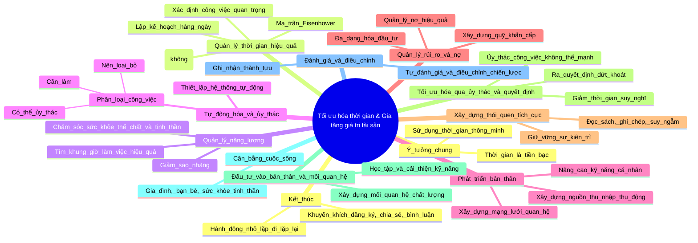

Xin chào bạn! Chào mừng bạn đến với kênh “Làm Chủ Tài Chính”. Bạn có biết rằng mỗi ngày trôi qua, chúng ta đều có chung một nguồn tài nguyên quý giá – đó chính là thời gian? Thế nhưng, cách mà chúng ta sử dụng thời gian lại quyết định sự khác biệt lớn lao trong giá trị tài sản, sự thành công và hạnh phúc của mỗi người.

Hôm nay, tôi sẽ chia sẻ với bạn một chủ đề cực kỳ quan trọng và thú vị: “Làm thế nào để tối ưu hóa thời gian nhằm gia tăng giá trị tài sản của bạn”. Hãy ở lại đến cuối video, vì những mẹo mà tôi sắp chia sẻ không chỉ giúp bạn nâng cao hiệu quả công việc mà còn tạo dựng nền tảng tài chính bền vững cho tương lai.

Trong video này, chúng ta sẽ cùng khám phá từng bước cách tận dụng thời gian để tạo ra giá trị lớn hơn cho chính mình. Đây không chỉ là câu chuyện của việc làm việc chăm chỉ mà còn là cách làm việc một cách thông minh và có chiến lược. Bạn đang xem kênh “Làm Chủ Tài Chính”, nơi chúng tôi luôn nỗ lực mang đến cho bạn những kiến thức thực tiễn và dễ áp dụng nhất về tài chính, kinh doanh và đầu tư. Hãy nhấn nút “Đăng ký” ngay hôm nay để không bỏ lỡ bất kỳ nội dung hữu ích nào trong tương lai.

---

Bây giờ, chúng ta hãy bắt đầu với ý tưởng đầu tiên: “Thời gian là tiền bạc”. Cách bạn sử dụng thời gian có thể giúp bạn trở nên giàu có hoặc khiến bạn mãi mắc kẹt trong vòng xoáy của sự trì trệ. Hãy thử tưởng tượng mỗi ngày của bạn như một chiếc vali chứa đầy tiền mặt; số tiền đó sẽ biến mất hoàn toàn nếu bạn không biết cách sử dụng nó một cách khôn ngoan. Vậy làm thế nào để tận dụng tối đa chiếc vali đó? Bí quyết nằm ở việc phân bổ thời gian của bạn một cách hợp lý và tập trung vào những điều thực sự mang lại giá trị.

Trước hết, bạn cần hiểu rõ đâu là những công việc quan trọng nhất đối với bạn. Một sai lầm phổ biến mà nhiều người mắc phải là để bản thân bị cuốn vào những công việc lặt vặt, không mang lại giá trị lâu dài. Hãy dành thời gian để xác định những mục tiêu lớn nhất trong cuộc đời, cả về tài chính, sự nghiệp và cá nhân. Sau khi đã rõ ràng về mục tiêu, hãy liệt kê ra những bước cụ thể cần làm để đạt được chúng, đồng thời loại bỏ hoặc giảm thiểu những việc không liên quan. Một công cụ cực kỳ hiệu quả để làm việc này là “Ma trận Eisenhower”, chia các công việc thành bốn nhóm: quan trọng và khẩn cấp, quan trọng nhưng không khẩn cấp, không quan trọng nhưng khẩn cấp, và không quan trọng lẫn không khẩn cấp. Nhiệm vụ của bạn là tập trung vào nhóm công việc “quan trọng nhưng không khẩn cấp”, vì đây chính là những hoạt động mang tính chiến lược, giúp bạn xây dựng giá trị lâu dài.

Thứ hai, bạn cần học cách nói “không” với những điều không cần thiết. Một trong những nguyên nhân chính khiến chúng ta lãng phí thời gian là vì thường đồng ý với quá nhiều yêu cầu, lời mời hay trách nhiệm không thực sự quan trọng. Hãy nhớ rằng thời gian của bạn là hữu hạn; việc nói “không” với những thứ không phục vụ cho mục tiêu của bạn không chỉ giúp bạn có thêm thời gian mà còn giúp bạn tập trung hơn vào những điều quan trọng.

Cuối cùng, trong phần này hãy bắt đầu thay đổi thói quen hàng ngày của bạn để phù hợp với mục tiêu tài chính. Ví dụ, nếu bạn muốn tăng thu nhập, hãy dành ít nhất một giờ mỗi ngày để học thêm kiến thức mới, tìm kiếm cơ hội kinh doanh hoặc cải thiện kỹ năng chuyên môn. Đừng quên rằng mỗi phút bạn dành ra hôm nay sẽ mang lại giá trị gấp nhiều lần trong tương lai nếu bạn sử dụng nó một cách đúng đắn.

---

Tiếp theo, trong hành trình tối ưu hóa thời gian để gia tăng giá trị tài sản, chúng ta sẽ đi sâu vào những chiến lược cụ thể hơn. Một trong những yếu tố quan trọng nhất mà bạn cần nắm vững chính là quản lý năng lượng của bản thân, bởi lẽ dù bạn có bao nhiêu thời gian đi nữa, nếu không có đủ năng lượng để làm việc, tất cả cũng trở nên vô nghĩa. Hãy cùng khám phá cách duy trì sự cân bằng giữa thời gian và năng lượng để đạt hiệu quả tối đa.

Điểm mấu chốt đầu tiên là bạn cần ưu tiên chăm sóc sức khỏe thể chất và tinh thần. Một lối sống lành mạnh không chỉ giúp bạn có nhiều năng lượng hơn để làm việc mà còn cải thiện khả năng tập trung và ra quyết định. Hãy bắt đầu từ những việc đơn giản nhất: ngủ đủ giấc, duy trì chế độ ăn uống cân bằng và thường xuyên vận động. Nhiều nghiên cứu đã chỉ ra rằng chỉ cần tập thể dục 30 phút mỗi ngày, bạn có thể tăng cường đáng kể khả năng làm việc và sáng tạo. Ngoài ra, hãy học cách lắng nghe cơ thể và xác định khung giờ làm việc hiệu quả nhất trong ngày. Mỗi người đều có một nhịp sinh học riêng; việc nắm bắt được thời điểm mình tràn đầy năng lượng nhất sẽ giúp bạn tận dụng tối đa thời gian quý báu.

Ví dụ, một số người cảm thấy sáng tạo và tập trung nhất vào buổi sáng, trong khi một số khác làm việc tốt hơn vào buổi chiều hoặc tối. Hãy thử nghiệm và tìm ra lịch trình phù hợp nhất với bản thân. Bước tiếp theo là loại bỏ những yếu tố gây sao nhãng trong môi trường làm việc. Bạn có nhận ra rằng mỗi lần bị gián đoạn, bạn cần rất nhiều thời gian để lấy lại sự tập trung? Để giảm thiểu điều này, hãy thiết lập không gian làm việc của bạn sao cho gọn gàng, ngăn nắp và ít bị quấy rầy nhất có thể. Nếu bạn thường xuyên sử dụng các thiết bị điện tử, hãy tắt thông báo không cần thiết hoặc sử dụng các ứng dụng hỗ trợ quản lý thời gian để hạn chế việc lãng phí vào những việc không quan trọng.

Khi đã kiểm soát tốt năng lượng và không gian làm việc, chúng ta sẽ đến với một chiến lược không kém phần quan trọng: tận dụng sức mạnh của việc lập kế hoạch mỗi buổi sáng. Hãy dành ra 10 đến 15 phút để lên danh sách những việc cần làm trong ngày và sắp xếp chúng theo thứ tự ưu tiên. Một danh sách rõ ràng không chỉ giúp bạn tránh bỏ sót những nhiệm vụ quan trọng mà còn mang lại cảm giác thành tựu mỗi khi hoàn thành một công việc nào đó. Bạn cũng nên áp dụng nguyên tắc “55/50”: cứ sau mỗi 50 phút làm việc, hãy dành ra 5 đến 10 phút để nghỉ ngơi. Khoảng thời gian ngắn này sẽ giúp não bộ bạn được thư giãn và tái tạo năng lượng, từ đó tăng hiệu suất làm việc. Nếu bạn đang phải đối mặt với những công việc lớn, hãy chia nhỏ chúng thành các phần nhỏ hơn để dễ dàng xử lý; mỗi khi hoàn thành một phần, bạn sẽ có thêm động lực để tiếp tục tiến về phía trước.

Ngoài ra, hãy tận dụng sức mạnh của công nghệ để làm việc thông minh hơn. Có rất nhiều công cụ và ứng dụng hỗ trợ quản lý thời gian, công việc hoặc tài chính mà bạn có thể sử dụng. Ví dụ, bạn có thể dùng các ứng dụng nhắc nhở, lịch làm việc hoặc phần mềm quản lý dự án để theo dõi tiến độ công việc. Tuy nhiên, đừng để công nghệ trở thành con dao hai lưỡi khiến bạn lãng phí thời gian vào những thứ không cần thiết như mạng xã hội hay trò chơi giải trí.

Cuối cùng, điều quan trọng nhất trong việc tối ưu hóa thời gian là hãy luôn hướng đến mục tiêu lớn của bạn. Mỗi ngày, hãy tự hỏi mình: “Những việc tôi làm hôm nay có giúp tôi tiến gần hơn đến mục tiêu tài chính không?” Nếu câu trả lời là “không”, có lẽ bạn đang đi lệch hướng và cần điều chỉnh lại kế hoạch của mình. Đừng quên rằng thành công không đến từ những việc làm lớn lao trong một ngày, mà là từ những hành động nhỏ lặp đi lặp lại mỗi ngày.

---

Chúng ta vừa đề cập đến tầm quan trọng của việc quản lý năng lượng, môi trường làm việc và công cụ hỗ trợ. Bây giờ, hãy đi sâu hơn vào các chiến lược dài hạn giúp bạn không chỉ tối ưu hóa thời gian mà còn gia tăng giá trị tài sản một cách bền vững.

Một yếu tố quan trọng mà bạn cần chú trọng là xây dựng các hệ thống tự động hóa trong cuộc sống và công việc. Tự động hóa không chỉ là việc áp dụng công nghệ mà còn là thiết lập các quy trình để giảm thiểu sự can thiệp của bạn vào những công việc lặp đi lặp lại. Ví dụ, hãy thiết lập các khoản tiết kiệm tự động từ tài khoản ngân hàng của bạn để mỗi tháng bạn không phải lo lắng về việc quên bỏ ra một khoản đầu tư. Tương tự, trong công việc, nếu bạn thấy một nhiệm vụ nào đó thường xuyên lặp lại, hãy xem xét cách có thể tự động hóa hoặc ủy thác nó.

Tiếp theo, hãy tập trung vào việc phát triển kỹ năng cá nhân. Những người thành công không chỉ làm việc chăm chỉ mà còn đầu tư thời gian để học hỏi và nâng cao giá trị bản thân. Bạn cần xác định những kỹ năng nào là cần thiết nhất cho mục tiêu tài chính và sự nghiệp của mình, sau đó tập trung vào việc rèn luyện chúng. Nếu bạn là một nhà kinh doanh, hãy cải thiện kỹ năng đàm phán, quản lý hoặc lãnh đạo; nếu bạn đang làm việc trong một lĩnh vực chuyên môn, hãy không ngừng cập nhật kiến thức mới hoặc học thêm các chứng chỉ quan trọng.

Một cách khác để tận dụng thời gian là xây dựng các nguồn thu nhập thụ động. Nhiều người chỉ tập trung vào việc làm một công việc chính mà bỏ qua cơ hội tạo ra những nguồn thu nhập bổ sung. Các nguồn thu nhập thụ động như đầu tư chứng khoán, bất động sản, bán hàng online hoặc viết sách không chỉ giúp bạn gia tăng tài sản mà còn giải phóng thời gian để bạn tập trung vào những mục tiêu lớn hơn. Hãy dành thời gian nghiên cứu và chọn một lĩnh vực phù hợp với sở thích cũng như thế mạnh của bạn. Ban đầu, bạn có thể cần đầu tư thời gian và công sức, nhưng về lâu dài, những nguồn thu nhập này sẽ hoạt động độc lập và mang lại lợi nhuận ổn định.

Bên cạnh đó, hãy xây dựng một mạng lưới mối quan hệ chất lượng. Việc bạn biết và hợp tác với ai có thể ảnh hưởng rất lớn đến thành công tài chính của bạn. Hãy dành thời gian để kết nối với những người có cùng trí hướng hoặc có kinh nghiệm trong lĩnh vực mà bạn đang theo đuổi. Những mối quan hệ này không chỉ mang lại cơ hội học hỏi mà còn mở ra nhiều cánh cửa mới cho sự nghiệp của bạn. Để xây dựng mối quan hệ tốt, hãy đặt sự chân thành và giá trị lên hàng đầu; hãy giúp đỡ người khác mà không mong đợi quá nhiều, vì những giá trị mà bạn tạo ra sẽ quay lại với bạn một cách bất ngờ.

Một yếu tố khác cần chú ý là khả năng thích nghi và linh hoạt. Cuộc sống luôn thay đổi và thị trường tài chính cũng vậy; việc bạn có thể nhanh chóng điều chỉnh chiến lược của mình khi đối mặt với những thách thức hoặc cơ hội mới là một lợi thế rất lớn. Hãy luôn chuẩn bị tâm thế để học hỏi điều mới và đừng ngại thay đổi khi cần thiết. Đừng quá bám víu vào những kế hoạch cũ nếu chúng không còn phù hợp. Hãy tự hỏi bản thân: “Làm thế nào tôi có thể làm tốt hơn, nhanh hơn hoặc hiệu quả hơn?” Sự cải tiến liên tục chính là chìa khóa giúp bạn tiến xa hơn trong hành trình tài chính của mình. Đặc biệt, hãy dành thời gian để suy ngẫm và đánh giá lại những gì bạn đã làm; đừng vội lao vào công việc mà không dừng lại để kiểm tra xem mình có đang đi đúng hướng hay không. Mỗi tuần, hãy dành một khoảng thời gian để xem lại các mục tiêu, đánh giá tiến độ và điều chỉnh nếu cần. Ghi chép lại những bài học mà bạn rút ra, vì chúng sẽ giúp bạn tránh lặp lại sai lầm trong tương lai.

Cuối cùng, đừng quên đặt sự cân bằng lên hàng đầu. Làm việc chăm chỉ và tối ưu hóa thời gian là cần thiết, nhưng đừng để chúng làm bạn quên mất những giá trị khác trong cuộc sống như gia đình, bạn bè và sức khỏe tinh thần. Hãy dành thời gian để tận hưởng những điều đơn giản và ý nghĩa trong cuộc sống, vì chúng chính là nguồn cảm hứng giúp bạn tiếp tục chinh phục những mục tiêu lớn hơn.

---

Tiếp theo, chúng ta sẽ đi sâu vào các nguyên tắc quan trọng để duy trì và phát triển thành quả lâu dài mà bạn đã xây dựng. Trước hết, hãy nói về sức mạnh của việc thiết lập mục tiêu rõ ràng và đo lường được. Khi bạn không biết rõ mình muốn đạt được điều gì, việc quản lý thời gian sẽ trở nên mơ hồ và thiếu hiệu quả. Một mục tiêu cụ thể không chỉ giúp bạn tập trung mà còn tạo động lực mạnh mẽ để vượt qua những trở ngại trên hành trình. Hãy chia mục tiêu lớn của bạn thành những mục tiêu nhỏ hơn, có thời hạn cụ thể để dễ dàng theo dõi tiến độ và điều chỉnh khi cần thiết. Một công cụ hữu ích trong việc thiết lập và theo dõi mục tiêu là nguyên tắc SMART – mục tiêu của bạn cần phải cụ thể, đo lường được, có thể đạt được, liên quan đến giá trị của bạn và có thời hạn rõ ràng.

Ví dụ: thay vì nói rằng bạn muốn tiết kiệm tiền, hãy đặt mục tiêu rằng bạn sẽ tiết kiệm một khoản nhất định (chẳng hạn 10 triệu đồng) trong vòng 3 tháng tới, bằng cách giảm chi tiêu và tăng thu nhập. Mục tiêu rõ ràng như vậy sẽ giúp bạn biết mình cần làm gì mỗi ngày để đạt được kết quả mong muốn.

Tiếp theo, hãy tập trung vào việc tạo dựng giá trị cho người khác. Đây là nguyên tắc cơ bản để phát triển sự nghiệp và tài sản một cách bền vững. Khi bạn giúp đỡ người khác giải quyết vấn đề của họ, bạn không chỉ nhận được sự ghi nhận mà còn xây dựng được lòng tin và mối quan hệ dài hạn. Dù bạn làm việc trong lĩnh vực nào, hãy luôn nghĩ đến cách bạn có thể mang lại giá trị cho khách hàng, đồng nghiệp hoặc cộng đồng. Những người thành công thường là những người luôn đặt lợi ích của người khác lên hàng đầu.

Một yếu tố không thể thiếu nữa là khả năng quản lý rủi ro trong cuộc sống và tài chính. Rủi ro là điều không thể tránh khỏi, tuy nhiên bạn có thể học cách giảm thiểu và kiểm soát chúng. Hãy luôn chuẩn bị một kế hoạch dự phòng cho những tình huống bất ngờ. Ví dụ, nếu bạn đầu tư vào cổ phiếu, hãy đa dạng hóa danh mục đầu tư của mình để giảm nguy cơ mất trắng khi thị trường biến động. Tương tự, trong công việc, hãy luôn có sẵn một kế hoạch thay thế để đảm bảo bạn không bị đình trệ nếu kế hoạch ban đầu không như ý. Một thói quen quan trọng để duy trì sự ổn định tài chính là xây dựng quỹ khẩn cấp; quỹ này sẽ là chiếc phao cứu sinh giúp bạn vượt qua những thời điểm khó khăn mà không ảnh hưởng đến mục tiêu dài hạn. Hãy đặt mục tiêu tiết kiệm một khoản tương đương với chi phí sinh hoạt từ 3 đến 6 tháng và dành riêng khoản tiền này cho những trường hợp bất khả kháng.

Ngoài ra, việc học cách quản lý nợ là rất cần thiết. Nếu bạn đang phải đối mặt với các khoản nợ, hãy lập kế hoạch trả nợ một cách khoa học. Ưu tiên thanh toán các khoản nợ có lãi suất cao, sau đó chuyển sang các khoản nợ nhỏ hơn; đồng thời, hãy cố gắng không vay mượn thêm trừ khi thực sự cần thiết và có kế hoạch cụ thể để trả nợ. Quản lý nợ hiệu quả sẽ giúp bạn giảm bớt áp lực tài chính và dành thời gian, nguồn lực cho những mục tiêu quan trọng hơn.

Tiếp đến, chúng ta không thể bỏ qua sức mạnh của việc xây dựng thói quen. Thói quen chính là những hành động nhỏ nhưng có sức ảnh hưởng lớn đến cuộc đời bạn. Những người thành công thường có những thói quen tích cực như đọc sách mỗi ngày, ghi chép lại những bài học quan trọng hoặc dành thời gian để suy ngẫm và lập kế hoạch. Hãy bắt đầu bằng cách chọn một thói quen nhỏ mà bạn muốn xây dựng, sau đó duy trì nó mỗi ngày cho đến khi nó trở thành một phần không thể thiếu trong cuộc sống của bạn.

Cuối cùng, hãy nhớ rằng sự kiên trì chính là chìa khóa dẫn đến thành công. Có những lúc bạn sẽ cảm thấy chán nản hoặc muốn bỏ cuộc, nhưng hãy nhớ rằng mọi nỗ lực bạn bỏ ra đều sẽ mang lại giá trị nếu bạn không từ bỏ. Hãy tập trung vào mục tiêu của mình và tiếp tục tiến bước, ngay cả khi bạn chỉ tiến lên một chút mỗi ngày. Những bước nhỏ đó sẽ cộng dồn và tạo nên sự khác biệt lớn lao trong tương lai.

---

Bây giờ, chúng ta hãy đi sâu hơn vào cách tối ưu hóa thời gian thông qua việc tận dụng nguồn lực xung quanh, cải thiện kỹ năng ra quyết định và tăng cường sự tập trung để đạt hiệu quả cao nhất. Một trong những chiến lược quan trọng để tối ưu hóa thời gian là học cách ủy thác. Nhiều người thường cố gắng làm tất cả mọi việc một mình vì nghĩ rằng như vậy sẽ tiết kiệm thời gian và chi phí. Tuy nhiên, sự thật là nếu bạn dành quá nhiều thời gian cho những công việc không phải thế mạnh của mình, bạn sẽ bỏ lỡ cơ hội tập trung vào những nhiệm vụ quan trọng và tạo ra giá trị lớn hơn. Hãy phân loại công việc của bạn thành ba nhóm: công việc bạn phải làm, công việc bạn có thể ủy thác và công việc bạn nên loại bỏ. Sau đó, tập trung tối đa vào nhóm công việc mà chỉ bạn có thể làm. Hãy tìm cách ủy thác những công việc khác cho người phù hợp để đạt hiệu quả cao. Bạn cần chọn đúng người và giao đúng việc; hãy đảm bảo rằng người mà bạn tin tưởng thực hiện công việc hiểu rõ mong muốn và kỳ vọng của bạn, đồng thời kiểm tra tiến độ thường xuyên để đảm bảo mọi thứ diễn ra đúng kế hoạch. Khi bạn biết cách tận dụng sức mạnh của đội nhóm hoặc cộng sự, bạn sẽ nhận ra rằng mình có thể đạt được nhiều hơn trong cùng một khoảng thời gian.

Tiếp theo, hãy bàn về việc ra quyết định hiệu quả. Một trong những nguyên nhân khiến nhiều người lãng phí thời gian là do họ mất quá nhiều thời gian để suy nghĩ và phân vân giữa các lựa chọn. Để cải thiện điều này, bạn cần học cách ra quyết định một cách dứt khoát, dựa trên thông tin hiện có. Đừng cố gắng tìm kiếm sự hoàn hảo, vì thực tế không có lựa chọn nào là hoàn hảo tuyệt đối. Hãy xác định rõ ưu tiên của mình, đánh giá các lựa chọn dựa trên lợi ích và rủi ro, sau đó đưa ra quyết định và hành động ngay lập tức. Khi đối mặt với những quyết định lớn, hãy áp dụng nguyên tắc “10 – Hãy tự hỏi: quyết định này sẽ ảnh hưởng đến tôi như thế nào trong 10 phút, 10 tháng và 10 năm tới”. Nguyên tắc này sẽ giúp bạn đánh giá tác động lâu dài của mỗi lựa chọn và tránh bị cuốn vào những quyết định chỉ mang lại lợi ích ngắn hạn.

Một yếu tố quan trọng khác trong việc tối ưu hóa thời gian là sự tập trung. Trong thế giới hiện đại, chúng ta liên tục bị sao nhãng bởi mạng xã hội, email, tin nhắn và hàng loạt thông báo khác. Để duy trì sự tập trung, bạn cần tạo ra một môi trường làm việc tối ưu và thiết lập các giới hạn rõ ràng. Hãy tắt những thông báo không cần thiết trên điện thoại và máy tính, dành thời gian làm việc trong một không gian yên tĩnh và thông báo cho người xung quanh về thời gian mà bạn không muốn bị quấy rầy. Một kỹ thuật đơn giản nhưng hiệu quả để tăng cường sự tập trung là phương pháp làm việc theo chu kỳ thời gian: 25 phút làm việc, 5 phút nghỉ ngơi. Phương pháp này không chỉ giúp bạn duy trì sự tập trung mà còn giảm căng thẳng và ngăn ngừa tình trạng kiệt sức. Trong mỗi chu kỳ, hãy tập trung hoàn toàn vào một nhiệm vụ cụ thể và tránh làm nhiều việc cùng lúc, vì đa nhiệm không chỉ làm giảm hiệu suất mà còn khiến bạn dễ mắc sai lầm hơn.

Ngoài ra, hãy sử dụng thời gian chết một cách thông minh. Thời gian chờ đợi ở sân bay, trên xe buýt hay khi xếp hàng có thể được tận dụng để đọc sách, nghe podcast hoặc suy nghĩ về các ý tưởng mới. Việc tận dụng những khoảng thời gian nhỏ này sẽ giúp bạn tiết kiệm được một lượng thời gian đáng kể trong ngày.

Không thể không nhắc đến việc xây dựng sự kiên trì trong công việc. Đôi khi, bạn sẽ gặp phải những ngày mà mọi thứ dường như đi trệ, hoặc bạn cảm thấy không có động lực để làm việc. Hãy nhớ rằng sự kiên trì là yếu tố quan trọng giúp bạn vượt qua những thời điểm khó khăn và tiến đến thành công. Để duy trì động lực, hãy luôn tập trung vào lý do tại sao bạn bắt đầu và nhắc nhở bản thân về những mục tiêu mà bạn đang hướng tới.

Cuối cùng, hãy học cách nói “không” một cách khéo léo. Nhiều người cảm thấy khó từ chối những yêu cầu không phù hợp vì sợ làm mất lòng người khác. Tuy nhiên, việc nói “có” quá nhiều sẽ khiến bạn bị phân tâm và không còn đủ thời gian cho những việc thực sự quan trọng. Hãy nhớ rằng mỗi lần bạn nói “có” với một việc gì đó, bạn đang nói “không” với một điều khác. Ưu tiên những mục tiêu và giá trị của bạn, và chỉ đồng ý với những điều thực sự quan trọng.

---

Trong phần cuối, chúng ta sẽ tìm hiểu thêm về tầm quan trọng của việc đầu tư vào bản thân, xây dựng mối quan hệ bền vững và tạo dựng những nguồn thu nhập ổn định. Một trong những khoản đầu tư mang lại lợi nhuận cao nhất chính là đầu tư vào bản thân. Không có gì quý giá hơn việc bạn dành thời gian và nguồn lực để học hỏi, cải thiện kỹ năng và phát triển kiến thức của mình. Thế giới luôn thay đổi, và để không bị tụt lại phía sau, bạn cần liên tục trau dồi bản thân. Hãy dành một phần thu nhập và thời gian để tham gia các khóa học, đọc sách hoặc tham dự các buổi hội thảo có giá trị. Điều này không chỉ giúp bạn nâng cao năng lực mà còn mở ra nhiều cơ hội mới trong công việc và cuộc sống. Hãy nhớ rằng học tập không chỉ giới hạn trong sách vở hay lớp học; bạn có thể học từ những người xung quanh, từ kinh nghiệm thực tế và từ những thất bại mà bạn đã trải qua. Mỗi trải nghiệm, dù tích cực hay tiêu cực, đều mang đến những bài học quý giá. Nếu bạn biết cách quan sát và rút ra bài học, hãy luôn giữ tinh thần học hỏi và đừng ngại thay đổi bản thân để thích nghi với những thách thức mới.

Tiếp theo, hãy nói về sức mạnh của mối quan hệ. Một mạng lưới quan hệ vững mạnh không chỉ giúp bạn mở rộng cơ hội kinh doanh mà còn mang lại sự hỗ trợ tinh thần trong những lúc khó khăn. Hãy dành thời gian để xây dựng và duy trì các mối quan hệ chất lượng. Điều này không có nghĩa là bạn phải kết nối với càng nhiều người càng tốt, mà là tập trung vào những mối quan hệ có giá trị và ý nghĩa. Để xây dựng mối quan hệ bền vững, hãy đặt sự chân thành lên hàng đầu; luôn nghĩ đến cách bạn có thể giúp đỡ người khác thay vì chỉ tìm kiếm lợi ích từ họ. Khi bạn thể hiện được sự quan tâm và chân thành, người khác sẽ sẵn lòng hỗ trợ bạn khi bạn cần. Đồng thời, hãy dành thời gian để kết nối với những người có cùng trí hướng và giá trị sống, vì họ sẽ truyền cảm hứng và động lực để bạn tiếp tục phấn đấu.

Một yếu tố quan trọng khác để tối ưu hóa thời gian và gia tăng giá trị tài sản là xây dựng nguồn thu nhập thụ động. Thay vì chỉ dựa vào công việc chính, bạn nên tìm cách tạo ra các nguồn thu nhập khác để giảm bớt sự phụ thuộc vào một nguồn duy nhất. Có nhiều cách để tạo thu nhập thụ động, chẳng hạn như đầu tư vào bất động sản, cổ phiếu hoặc các dự án kinh doanh nhỏ; bạn cũng có thể kiếm thu nhập từ việc chia sẻ kiến thức và kỹ năng của mình, chẳng hạn qua việc viết sách, giảng dạy trực tuyến hoặc sáng tạo nội dung số. Một trong những lợi ích lớn nhất của thu nhập thụ động là nó giúp bạn có thêm thời gian để tập trung vào những mục tiêu lớn hơn. Tuy nhiên, để đạt được điều này, bạn cần đầu tư thời gian và công sức ban đầu để thiết lập và duy trì các nguồn thu nhập. Hãy bắt đầu với những lĩnh vực mà bạn đã có kiến thức hoặc đam mê, sau đó dần dần mở rộng khi bạn đã có kinh nghiệm.

Trong quá trình xây dựng tài sản, hãy luôn ghi nhớ nguyên tắc “Tiết kiệm và Đầu tư Thông Minh”. Tiết kiệm không có nghĩa là bạn phải cắt giảm tất cả những chi tiêu không cần thiết, mà là tìm cách chi tiêu một cách hợp lý và dành ra một phần thu nhập để đầu tư hiệu quả. Một quy tắc phổ biến trong quản lý tài chính cá nhân là quy tắc 50-30-20: 50% thu nhập dùng cho các chi phí cần thiết, 30% cho các nhu cầu cá nhân và 20% để tiết kiệm hoặc đầu tư. Một khía cạnh quan trọng nữa là giữ cho bản thân luôn khỏe mạnh cả về thể chất và tinh thần. Sức khỏe chính là nền tảng giúp bạn duy trì năng lượng và hiệu quả trong công việc; hãy dành thời gian để tập luyện thể dục thường xuyên, ăn uống lành mạnh và ngủ đủ giấc, đồng thời dành thời gian để thư giãn và chăm sóc tâm trí của mình. Khi bạn khỏe mạnh và cân bằng, bạn sẽ có nhiều năng lượng hơn để tập trung vào các mục tiêu của mình.

Cuối cùng, hãy nhớ rằng thành công không chỉ đo bằng số tài sản bạn tích lũy được mà còn ở chất lượng cuộc sống mà bạn xây dựng. Hãy dành thời gian cho gia đình, bạn bè và những điều thực sự quan trọng đối với bạn. Tài sản có thể mang lại sự an tâm, nhưng tình yêu và mối quan hệ sẽ mang lại hạnh phúc thực sự.

---

Để kết thúc hành trình khám phá cách tối ưu hóa thời gian nhằm gia tăng giá trị tài sản, hãy cùng nhìn lại toàn bộ những nguyên tắc đã được chia sẻ, đồng thời tập trung vào cách duy trì và phát triển những chiến lược này trong dài hạn. Bởi lẽ, một kế hoạch dù tốt đến đâu cũng cần được thực thi nhất quán và liên tục cải thiện để đạt được hiệu quả tối ưu. Hãy nhớ rằng thành công không phải là đích đến mà là một hành trình. Tối ưu hóa thời gian không phải là một nhiệm vụ bạn thực hiện một lần rồi quên đi, mà là một quá trình cần được áp dụng mỗi ngày. Hãy thường xuyên đánh giá lại cách bạn sử dụng thời gian, nhận diện những thói quen hoặc hoạt động không còn phù hợp và điều chỉnh chiến lược của mình cho phù hợp với những thay đổi trong cuộc sống. Để duy trì động lực, hãy sử dụng hệ thống ghi nhận thành tựu: mỗi khi bạn đạt được một mục tiêu, dù lớn hay nhỏ, hãy dành thời gian để ăn mừng và tự thưởng cho bản thân. Điều này không chỉ giúp bạn cảm thấy hứng khởi mà còn nhắc nhở bạn về giá trị của những nỗ lực mình đã bỏ ra. Những bước tiến nhỏ, nếu được duy trì đều đặn, sẽ dẫn đến những kết quả lớn hơn mà bạn có thể chưa từng nghĩ đến. Hãy luôn đặt mình trong trạng thái học hỏi và cải thiện, đừng bao giờ ngừng tìm kiếm những cách mới để làm việc hiệu quả hơn, quản lý thời gian tốt hơn và tối ưu hóa nguồn lực của mình. Công nghệ, kiến thức và phương pháp làm việc luôn thay đổi, vì vậy bạn cần cập nhật liên tục để không bị tụt lại phía sau. Một cách hiệu quả để làm điều này là tham gia các cộng đồng hoặc nhóm có cùng mối quan tâm, nơi bạn có thể học hỏi từ những người khác và chia sẻ kinh nghiệm của chính mình.

Cuối cùng, trong hành trình này, có một điều quan trọng bạn cần nhớ: hãy giữ vững sự cân bằng. Đừng để mục tiêu gia tăng tài sản hay tối ưu hóa thời gian làm bạn mất đi sự kết nối với những giá trị cốt lõi trong cuộc sống. Tài sản là công cụ để cải thiện chất lượng cuộc sống chứ không phải là mục tiêu cuối cùng. Hãy luôn dành thời gian cho gia đình, bạn bè và những hoạt động mang lại ý nghĩa, niềm vui cho bạn.

Một chiến lược quan trọng khác để duy trì sự phát triển là xây dựng một “vòng tròn ảnh hưởng tích cực” – đó là nhóm những người có giá trị sống và tư duy phù hợp, những người sẽ hỗ trợ, động viên và thách thức bạn phát triển hơn nữa. Hãy tìm kiếm những người có kinh nghiệm thành công trong lĩnh vực bạn quan tâm hoặc những người luôn truyền cảm hứng để bạn trở thành phiên bản tốt nhất của mình. Một mối quan hệ tích cực không chỉ mang lại động lực mà còn giúp bạn học hỏi từ những góc nhìn mới. Khi bạn đã xây dựng được nền tảng vững chắc về việc quản lý thời gian và tài sản, hãy nghĩ đến việc chia sẻ những gì bạn học được với người khác. Giúp đỡ người khác không chỉ mang lại ý nghĩa cho cuộc sống của bạn mà còn củng cố kiến thức của chính bạn. Khi bạn giải thích hoặc hướng dẫn người khác, bạn đang tái khẳng định sự hiểu biết của mình và phát triển kỹ năng giao tiếp. Đồng thời, việc lan tỏa giá trị còn tạo ra một cộng đồng tích cực, nơi mọi người cùng hỗ trợ nhau tiến bộ.

Trong những phút cuối của video, hãy nhắc nhở người xem rằng mọi thành công lớn đều bắt đầu từ những hành động nhỏ được lặp đi lặp lại mỗi ngày. Bạn không cần phải làm mọi thứ hoàn hảo ngay lập tức; điều quan trọng là hãy bắt đầu, không ngừng nỗ lực và duy trì sự kiên định. Hãy tin rằng mỗi bước đi, dù nhỏ đến đâu, đều đang đưa bạn tiến gần hơn đến mục tiêu của mình. Cuối cùng, đây là lời nhắn nhủ quan trọng nhất: thành công không phải là điều xa vời mà là kết quả của việc bạn biết trân trọng thời gian và sử dụng nó một cách thông minh. Mỗi ngày, mỗi giờ, mỗi phút bạn sống là cơ hội để tạo ra giá trị không chỉ cho bản thân mà còn cho những người xung quanh. Hãy hành động ngay hôm nay và biến thời gian thành tài sản quý giá nhất của bạn.

Kết thúc video, hãy khuyến khích người xem tiếp tục hành trình này bằng cách nhấn “Đăng ký” kênh, chia sẻ video hoặc để lại bình luận về những điều họ học được và áp dụng vào cuộc sống. Đừng quên nhấn mạnh rằng mọi người đều có tiềm năng để làm chủ tài chính và tối ưu hóa thời gian, chỉ cần họ sẵn lòng bắt đầu từ bây giờ. Chúc bạn thành công và hãy nhớ rằng làm chủ thời gian chính là làm chủ cuộc đời!

