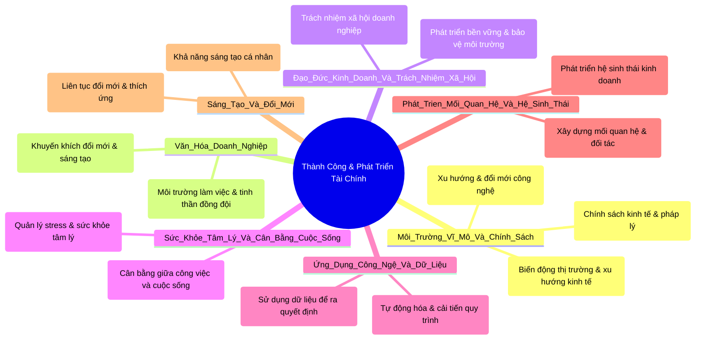

# Tại Sao Bạn Mãi Nghèo - Bẻ Gãy Tư Duy Cũ Để Làm Giàu Ngay Hôm Nay

---

Bạn có bao giờ tự hỏi tại sao có những người vươn lên từ con số không để trở nên giàu có, trong khi có những người dù làm việc chăm chỉ suốt đời vẫn chật vật trong vòng lặp “cơm, áo, gạo, tiền”? Tại sao có người kiếm được hàng trăm triệu, hàng tỷ đồng mỗi tháng, còn bạn thì vẫn loay hoay, không biết làm sao để tăng thu nhập? Câu trả lời không nằm ở việc bạn làm việc bao nhiêu giờ mỗi ngày, mà nằm ở cách bạn suy nghĩ về tiền bạc, công việc và bản thân mình.  
 
Người giàu không làm việc vất vả hơn bạn; họ làm việc thông minh hơn. Họ tư duy khác bạn, họ hiểu cách tiền vận hành và, quan trọng nhất, họ không bao giờ tự huyễn hoặc bản thân rằng mình “ổn” rồi. Họ luôn giữ một tư duy “ở đáy”, biết rằng mình vẫn còn phải học hỏi, biết rằng mình chưa giỏi đến mức có thể ngừng nỗ lực. Chính vì thế, họ liên tục phát triển, liên tục tối ưu cách kiếm tiền và từ đó bứt phá, trong khi bạn vẫn dậm chân tại chỗ.

Hôm nay, tôi sẽ giúp bạn thay đổi tư duy về tiền bạc và làm giàu, để bạn không còn lãng phí thời gian vào những thứ vô nghĩa mà thay vào đó bắt đầu xây dựng một cuộc sống tài chính vững chắc.

---

Chắc chắn rằng bạn sẽ lo được cho bản thân và cho gia đình. Đây là kênh “Đạo Cổ Nhân” – nơi tôi chia sẻ những triết lý thực tế giúp bạn làm giàu và phát triển bản thân theo những nguyên tắc bền vững của cổ nhân. Nếu bạn muốn thoát khỏi sự trì trệ và thực sự thay đổi, hãy theo dõi đến cuối video này.

**Phần 1: Tại sao làm việc chăm chỉ không giúp bạn giàu có**

Đó là một nghịch lý trong cuộc sống mà ít ai chịu chấp nhận: làm việc chăm chỉ không giúp bạn giàu có. Đây là một sự thật phũ phàng, nhưng nếu bạn không hiểu điều này, bạn sẽ mắc kẹt cả đời trong vòng lặp cố gắng kiệt sức mà không đi đến đâu.

Tôi từng biết một người đàn ông tên là anh Nam. Anh ấy làm việc trong một công ty suốt 10 năm, đều đặn từ 10 đến 12 tiếng một ngày. Không có ngày nào anh lười biếng, không có ngày nào anh không nỗ lực. Nhưng sau 10 năm, lương anh chỉ tăng thêm vài triệu, trong khi vật giá leo thang, cuộc sống ngày càng đắt đỏ. Hàng tháng, anh vẫn chật vật xoay sở với tiền nhà, tiền học cho con, tiền thuốc cho cha mẹ già. Anh không hề lười, chỉ đang chơi sai “cuộc chơi”. Đây chính là vấn đề của rất nhiều người: họ nghĩ rằng chỉ cần làm việc chăm chỉ là sẽ được đền đáp, nhưng họ quên mất rằng tiền không đến từ sự vất vả mà đến từ cách bạn tạo ra giá trị và tận dụng “đòn bẩy”.  

Tiền không đến từ thời gian bạn bỏ ra mà đến từ giá trị bạn tạo ra. Nếu tiền chỉ đến từ số giờ bạn làm việc, thì những người lao động chân tay hay những người tăng ca cả ngày lẫn đêm phải là những người giàu nhất. Nhưng thực tế, ai đang kiếm được nhiều tiền nhất chính là những người biết tận dụng giá trị của mình để tạo ra thu nhập không giới hạn. Hãy thử nhìn vào hai người: một anh thợ xây làm 10 tiếng mỗi ngày với thu nhập 500.000 đồng, dù tăng ca đến 12 tiếng thì anh cũng chỉ kiếm được thêm một chút vì sức lực có giới hạn; trong khi một người bán hàng online chỉ cần tạo ra một quảng cáo tốt, một chiến lược hợp lý, có thể bán được hàng nghìn sản phẩm mà không cần tốn thêm thời gian gấp bội. Cả hai đều làm việc, nhưng cách làm khác nhau dẫn đến kết quả hoàn toàn khác nhau.

Hai người giàu sử dụng “đòn bẩy”:
- **Đòn bẩy tiền bạc:** Họ không giữ tiền chỉ để nằm yên trong ngân hàng mà để nó sinh lời thông qua đầu tư.
- **Đòn bẩy thời gian:** Họ không tự làm tất cả mọi việc mà thuê người giỏi hơn làm thay họ.
- **Đòn bẩy tri thức:** Họ không chỉ làm theo cảm tính mà học hỏi từ những người đã thành công, sử dụng kiến thức để đưa ra quyết định đúng đắn.

Một người tự làm tất cả mọi thứ sẽ luôn bị giới hạn bởi thời gian của mình, trong khi đó, một người biết cách xây dựng hệ thống, thuê nhân sự, đầu tư tài sản thì dù ngủ, tiền vẫn “chạy” về túi.  

Họ mắc ba “cái bẫy” của sự chăm chỉ: bạn có thực sự tiến lên hay không? Nhiều người làm việc suốt ngày mà vẫn không khá hơn vì họ chỉ đang lặp lại một mô hình cũ thay vì tối ưu và phát triển. Hãy tưởng tượng bạn đang trèo một chiếc thuyền trên dòng nước chảy xiết. Nếu bạn chỉ biết chèo mạnh hơn, bạn sẽ kiệt sức mà không tiến xa được. Nhưng nếu bạn biết cách định hướng đúng dòng nước, bạn có thể lướt đi nhanh hơn mà không tốn quá nhiều sức. Làm việc vất vả mà không có tư duy đúng chỉ khiến bạn kiệt quệ mà không giàu lên; ngược lại, chỉ cần thay đổi cách nghĩ, bạn có thể kiếm tiền thông minh và hiệu quả hơn.

Bài học thay đổi tư duy: Ngay hôm nay, thay vì hỏi “làm sao để làm việc nhiều hơn”, hãy hỏi “làm sao để công sức của mình tạo ra nhiều giá trị hơn”, “làm sao để đòn bẩy của bạn được nhân lên”, “làm sao để mỗi giờ làm việc của mình đáng giá gấp hai, gấp ba lần”. Hiện tại, người giàu không làm việc nhiều hơn bạn; họ chỉ biết cách làm việc thông minh hơn.

---

**Phần 2: Tư duy “ở đáy” – Bước đầu tiên để làm giàu**

Một trong những lý do lớn nhất khiến nhiều người mãi không thể giàu lên không phải vì họ không có cơ hội, mà vì họ không biết mình đang đứng ở đâu. Họ hoặc ảo tưởng rằng mình giỏi, hoặc quá tự ti để dám bước ra khỏi vùng an toàn; cả hai tư duy đó đều là rào cản khiến họ không thể bứt phá.  

Người giàu luôn có một điểm chung: họ giữ cho mình tư duy “ở đáy”. Điều này không có nghĩa là họ nghĩ mình kém cỏi, mà là họ luôn biết mình chưa đủ giỏi và sẵn sàng học hỏi. Tư duy này giúp họ không ngừng phát triển, không bao giờ “ngủ quên” trên chiến thắng, và đặc biệt, luôn có ý thức tự tối ưu để kiếm nhiều tiền hơn.

Có hai kiểu người thất bại:
1. **Nhóm thứ nhất:** Những người nghĩ rằng họ đã giỏi. Khi kiếm được một chút tiền, họ lập tức tự mãn, cho rằng mình đã hơn người, cho rằng đã đủ thành công. Họ dừng học hỏi, dừng tối ưu và, chính vì thế, sớm muộn cũng sẽ tụt lại phía sau. Tôi từng quen một người anh gọi là anh H. Cách đây 5 năm, anh ấy mở một chuỗi quán cà phê, ăn nên làm ra tiền chảy về ào ạt. Anh tự tin rằng mình đã hiểu hết về kinh doanh, mở rộng thêm năm chi nhánh, thuê hàng chục nhân sự, chi tiêu mạnh tay hơn, nhưng anh không để ý rằng mô hình kinh doanh của mình chưa tối ưu, chi phí vận hành ngày càng tăng mà lợi nhuận thực ra không còn nhiều. Đến khi thị trường thay đổi, các đối thủ cạnh tranh mạnh hơn, chi phí mặt bằng tăng, anh ấy sụp đổ; chỉ sau hai năm, tất cả năm chi nhánh đóng cửa, anh gần như mất trắng.
2. **Nhóm thứ hai:** Những người không tin vào chính mình. Họ sợ thất bại đến mức không dám làm gì cả, cứ đợi thời điểm hoàn hảo – đợi có vốn rồi mới kinh doanh, đợi học đủ rồi mới dám bắt đầu – và cứ thế, họ mãi không bao giờ có được sự bứt phá. Tôi từng gặp một người em rất giỏi về marketing online, có kiến thức, có tư duy, nhưng suốt 3 năm vẫn chỉ làm nhân viên cho người khác; mãi không dám tự kinh doanh vì em sợ thất bại. Trong khi đó, có một người khác cùng xuất phát điểm nhưng dám thử, dám chấp nhận rủi ro; sau hai năm, người đó đã có thu nhập hàng trăm triệu mỗi tháng, còn em của tôi thì vẫn nhận mức lương 12 triệu như cũ.

Bài học: Sự sợ hãi không giúp bạn tránh khỏi rủi ro; ngược lại, nó chỉ khiến bạn mãi mãi không thể đi xa. Tư duy “ở đáy” giúp bạn kiếm tiền nhiều hơn như thế nào? Người thực sự giàu có luôn đặt mình vào trạng thái “chưa đủ giỏi”. Họ biết rằng họ có thể giỏi về kinh doanh, nhưng chưa chắc đã giỏi về đầu tư; họ có thể kiếm nhiều tiền nhưng nếu không biết quản lý tài chính, họ vẫn có thể mất trắng. Họ có thể thành công hôm nay, nhưng nếu không đổi mới, ngày mai họ sẽ bị người khác vượt mặt. Tư duy “ở đáy” giúp bạn luôn tò mò, luôn học hỏi để cải thiện cách kiếm tiền; không tự mãn khi thành công mà tìm cách nhân đôi, nhân ba kết quả; không sợ sai, không sợ thử, vì họ hiểu rằng thất bại là một phần của hành trình.

Làm thế nào để rèn tư duy “ở đáy”? Nếu bạn muốn kiếm nhiều tiền hơn, bước đầu tiên không phải là lao vào kiếm tiền mà là thay đổi tư duy. Hãy đặt câu hỏi: “Ai đang làm tốt hơn mình?” Người giàu không bao giờ xem thường ai cả; họ luôn học hỏi từ những người giỏi hơn. Nếu bạn muốn giàu, hãy quan sát và học hỏi những người đã thành công trong lĩnh vực bạn muốn theo đuổi. Liên tục đánh giá bản thân mỗi tháng; hãy tự hỏi: “Mình đã tiến bộ hơn tháng trước chưa? Mình đã học thêm điều gì mới chưa? Có ai đó làm cùng công việc như mình nhưng kiếm nhiều tiền hơn không? Họ đã làm khác mình ở đâu?”  
 
Hãy chấp nhận rằng thất bại là điều bình thường. Người giàu không sợ thất bại; họ biết rằng mất tiền trong một thương vụ là bài học, không phải là thất bại. Họ biết rằng thử một phương pháp mới có thể không thành công, nhưng nó sẽ giúp họ hiểu rõ hơn về thị trường.

---

**Phần 3: Đầu tư vào chính mình – “Mỏ vàng bị bỏ quên”**

Một sự thật mà ít ai nhận ra là cách đầu tư có lợi nhất không phải là đầu tư vào bất động sản, chứng khoán hay tiền điện tử mà là đầu tư vào chính bạn. Bất kỳ ai có thể lấy đi tiền bạc, tài sản của bạn, nhưng không ai có thể lấy đi kiến thức, kỹ năng và tư duy mà bạn đã tích lũy được. Nếu hôm nay bạn mất hết tiền, nhưng bạn có một “bộ não” biết cách kiếm tiền, chỉ sau vài năm bạn sẽ làm lại được tất cả. Những người thực sự giàu có hiểu rõ điều này và họ luôn coi việc đầu tư vào bản thân là khoản đầu tư có lợi nhuận cao nhất. Trong khi đó, nhiều người nghèo luôn ngại chi tiền cho việc học, nhưng lại sẵn sàng tiêu tiền cho những thứ không mang lại giá trị lâu dài – chẳng hạn như điện thoại, quần áo, xe cộ, giải trí – mà lại do dự khi đầu tư vào tài sản quan trọng nhất: chính bản thân họ.

Tôi có một người bạn gọi là anh A. Anh ấy từng than vãn với tôi rằng “đầu tư cho việc học hành tốn tiền quá”. Khi tôi giới thiệu cho anh một khóa học về kinh doanh trị giá 5 triệu đồng, anh lập tức nói: “5 triệu nhiều quá, thôi để khi nào có tiền rảnh rỗi rồi tính.” Nhưng chỉ một tuần sau, tôi thấy anh ấy bỏ ra 10 triệu đồng để mua điện thoại mới. Khi tôi hỏi tại sao, anh cười và đáp: “Sao, nếu xài điện thoại mới cho sướng thì sao?” Đây chính là tư duy khiến nhiều người mãi không giàu: họ không tiếc tiền cho tiêu sản, nhưng lại rất do dự khi đầu tư vào chính mình.

Người giàu luôn đặt ưu tiên cho đầu tư trí tuệ, vì họ hiểu rằng một khi có kỹ năng tốt hơn, tư duy tốt hơn, họ sẽ kiếm lại được nhiều tiền gấp bội. Hai thứ đáng để đầu tư nhất là:
1. **Kiến thức:** Người giàu đầu tư vào kiến thức tài chính, học hỏi về đầu tư, kinh doanh, dòng tiền… để mỗi đồng họ kiếm ra đều có thể sinh lời.
2. **Kỹ năng bán hàng và thuyết phục:** Dù bạn làm gì, bạn đều cần bán hàng – bán sản phẩm, dịch vụ, hoặc thậm chí là ý tưởng của mình. Nếu bạn giỏi bán hàng, bạn sẽ không bao giờ lo thiếu tiền.
 
Ngoài ra, đầu tư vào mối quan hệ cũng rất quan trọng. Người giàu chú trọng xây dựng mạng lưới quan hệ, vì họ biết rằng cơ hội đến từ con người, không phải từ sách vở. Nếu bạn ở trong một môi trường có nhiều người giỏi, bạn sẽ học hỏi nhanh hơn và có nhiều cơ hội hơn. Cuối cùng, đầu tư vào sức khỏe và tinh thần – bởi vì một bộ não sáng suốt nằm trong một cơ thể khỏe mạnh sẽ giúp bạn làm giàu. Người giàu luôn coi sức khỏe là tài sản quan trọng nhất; họ duy trì thói quen tập thể dục, ăn uống lành mạnh và kiểm soát căng thẳng.

---

**Phần 4: Tại sao người giàu không ngừng học hỏi**

Hãy nhìn vào những người thực sự thành công – bạn sẽ thấy một điểm chung: họ đọc sách, học hỏi và không bao giờ ngừng nâng cấp bản thân. Bill Gates dù là tỷ phú vẫn đọc hàng chục cuốn sách mỗi năm; Warren Buffett dành 80% thời gian mỗi ngày để đọc và suy ngẫm; Elon Musk học hỏi về chế tạo tên lửa chỉ bằng cách đọc sách và gặp gỡ các chuyên gia. Họ không đọc vì sợ bị lỗi thời, mà đọc vì họ hiểu rằng kiến thức là nguồn gốc của sự giàu có.

Ngược lại, những người nghèo thường có suy nghĩ: “Tôi không có thời gian để học; tôi không cần học thêm gì nữa; tôi biết đủ rồi. Học nhiều quá cũng không làm giàu được đâu.” Chính những suy nghĩ này khiến họ mãi giậm chân tại chỗ.

---

**Phần 5: Tại sao bạn nên kiếm tiền càng sớm càng tốt**

Có một câu nói rất hay: “Nếu bạn không bắt đầu ngay hôm nay, thì 5 năm sau bạn sẽ vẫn ở cùng một chỗ với những vấn đề tài chính như bây giờ.” Nhiều người nghĩ rằng “từ từ rồi tính” – chờ cho đến khi ổn định, rồi mới kiếm tiền, hoặc chờ khi nào có vốn lớn mới làm. Nhưng sự thật là, nếu bạn không bắt đầu ngay bây giờ, bạn sẽ mãi mãi không có thời điểm hoàn hảo để bắt đầu.

Tất cả những người giàu có đều có một điểm chung: họ không trì hoãn. Họ bắt đầu càng sớm càng tốt, thậm chí từ khi họ chưa thực sự sẵn sàng. Nếu bạn còn trẻ, hãy bắt đầu ngay bây giờ; nếu bạn đã ngoài 30, 40, thậm chí 50 tuổi, thì cũng không có nghĩa là đã muộn. Điều quan trọng không phải là bạn đang ở đâu, mà là bạn có dám bắt đầu ngay hôm nay hay không. Càng bắt đầu sớm, bạn càng có nhiều thời gian để tích lũy tài sản.

Người nghèo thường nghĩ rằng “chỉ cần làm việc chăm chỉ, tiết kiệm rồi sẽ ổn”, nhưng họ quên mất một điều quan trọng: tiền không tự lớn lên chỉ bằng tiết kiệm, mà phải được đầu tư và nhân lên theo thời gian. Hãy thử nhìn hai người:  
- Người A bắt đầu đầu tư từ năm 20 tuổi, mỗi tháng bỏ ra 5 triệu đồng với mức lãi suất trung bình 12,5%; đến năm 40 tuổi, anh ta có gần 6 tỷ đồng.  
- Người B cũng muốn có số tiền đó nhưng trì hoãn đến năm 30 tuổi mới bắt đầu; dù mỗi tháng bỏ ra gấp đôi (10 triệu đồng), đến năm 40 tuổi, anh chỉ có khoảng 3 tỷ đồng.  

Sự khác biệt là do lợi thế về thời gian – tài sản lớn nhất bạn có. Nếu bạn chờ đến khi có đủ tiền mới đầu tư, bạn sẽ mất đi cơ hội lớn nhất để gia tăng tài sản.

Có một sai lầm lớn mà rất nhiều người mắc phải: nghĩ rằng họ cần phải chuẩn bị thật hoàn hảo trước khi bắt đầu kiếm tiền. Tôi có một người bạn tên Minh, có một ý tưởng kinh doanh tuyệt vời, nhưng suốt 3 năm cậu ấy vẫn chưa bắt đầu vì luôn cảm thấy “chưa đủ giỏi, chưa có vốn, chưa đúng thời điểm.” Trong khi đó, một người khác tên Hoàng, với ý tưởng tương tự, đã dám thử và chấp nhận mắc sai lầm, điều chỉnh theo kinh nghiệm; chỉ sau hai năm, Hoàng đã kiếm được vài trăm triệu mỗi tháng, còn Minh thì vẫn ngồi đó chờ đợi thời điểm hoàn hảo.

Bài học ở đây là: không có thời điểm hoàn hảo. Nếu bạn cứ chờ đến khi có đủ tiền, đủ kiến thức, đủ kinh nghiệm thì bạn sẽ mãi mãi không bao giờ làm được; hãy bắt đầu ngay bây giờ. Bạn có thể bắt đầu nhỏ, nhưng quan trọng là bạn phải bắt đầu. Tiền không phải là vấn đề; tư duy mới là vấn đề. Nhiều người nói “tôi không có vốn nên không thể bắt đầu”, nhưng đó chỉ là một cái cớ. Người giàu không bao giờ để số tiền hiện có quyết định tương lai của mình; họ hiểu rằng vốn quan trọng, nhưng tư duy còn quan trọng hơn. Có những người khởi nghiệp với số vốn khiêm tốn, tận dụng kỹ năng, kiến thức và mạng lưới quan hệ; có những người không có tiền nhưng có ý tưởng, họ gọi vốn hợp tác hoặc bắt đầu từ những thứ không cần quá nhiều chi phí. Nếu bạn thực sự muốn làm giàu, bạn sẽ tìm cách; nếu không, bạn sẽ tìm lý do.

---

**Phần 6: Kết luận – Hành động ngay hôm nay**

Hãy tự hỏi: “Nếu tôi tiếp tục sống như cũ, không thay đổi gì cả, thì 5 năm nữa tôi sẽ ở đâu?” Nếu câu trả lời là “vẫn như cũ” hoặc “thậm chí còn tệ hơn”, thì đã đến lúc bạn phải hành động. Không ai có thể thay đổi cuộc đời bạn ngoại trừ chính bạn. Không có chính sách nào, không có may mắn nào, không có một phép màu nào có thể biến bạn từ một người bình thường trở thành một người giàu có, nếu bạn không thay đổi cách suy nghĩ và cách làm việc của mình.

Hãy nhìn lại những gì chúng ta đã cùng nhau phân tích trong suốt hành trình này: làm việc chăm chỉ không giúp bạn giàu, bạn cần làm việc thông minh; tư duy “ở đáy” giúp bạn không ngừng học hỏi và phát triển; đầu tư vào chính mình là cách làm giàu bền vững nhất. Người giàu không sợ mất tiền vì họ hiểu rằng tiền chỉ là công cụ. Càng bắt đầu kiếm tiền sớm, bạn càng có lợi thế hơn người khác, nhưng tất cả những điều này sẽ vô nghĩa nếu bạn không hành động ngay từ hôm nay.

Bạn có hai lựa chọn:  
1. Chọn sai – quay trở lại cuộc sống cũ, tiếp tục làm những điều quen thuộc, suy nghĩ theo lối mòn cũ, tiếp tục trì hoãn và để nỗi sợ kiểm soát bạn. Nếu bạn chọn cách này, tôi có thể đảm bảo rằng tương lai của bạn sẽ không khác gì hiện tại, hoặc thậm chí sẽ tệ hơn.  
2. Chọn đúng – bắt đầu thay đổi ngay từ hôm nay. Bạn có thể quyết định rằng từ nay bạn sẽ sống với tư duy của một người giàu: không sợ mất mát, không trì hoãn, không tự mãn, luôn học hỏi và sẵn sàng hành động. Tin tôi đi, chỉ cần bạn thay đổi cách suy nghĩ, mọi thứ trong cuộc sống của bạn sẽ thay đổi theo.

Hãy bắt đầu từ những thay đổi nhỏ nhưng đúng đắn: học hỏi mỗi ngày, dành ít nhất 30 phút để đọc sách về tài chính, kinh doanh, phát triển bản thân; nếu không thích đọc, hãy nghe podcast hoặc xem những video truyền cảm hứng; tạo một nguồn thu nhập thứ hai nếu công việc chính của bạn không giúp bạn giàu lên – bán hàng online, viết blog, làm dịch vụ tự do, hoặc đầu tư vào một dự án nhỏ. Điều quan trọng không phải là số tiền bạn có, mà là bạn học được gì từ việc đầu tư đó và có thể xây dựng được nguồn thu nhập thứ hai.

Hãy thay đổi tư duy về tiền bạc: đọc sách về tài chính, học hỏi từ những người thành công, ngừng sợ hãi và bắt đầu nhìn nhận tiền bạc như một công cụ để tạo ra cơ hội. Bạn không cần phải làm tất cả mọi thứ ngay lập tức, nhưng hãy bắt đầu bằng một việc gì đó từ hôm nay, vì nếu bạn không làm gì cả, 5 năm sau bạn sẽ vẫn như hiện tại – hoặc còn tệ hơn.

---

**Phần 7: Lời kết**

Nếu bạn 40 tuổi nhìn lại quãng thời gian đã qua và nhận ra rằng bạn đã bỏ lỡ quá nhiều cơ hội chỉ vì bạn chần chừ, hãy tự hỏi: “Tôi muốn cuộc sống của mình thay đổi như thế nào trong 5 năm tới?” Bạn sẽ chọn hành động ngay hôm nay hay tiếp tục trì hoãn và mãi mãi hối tiếc? Tất cả đều nằm trong tay bạn.

Đây chính là kênh “Đạo Cổ Nhân”, nơi tôi chia sẻ những tư duy làm giàu và phát triển bản thân theo những nguyên tắc bền vững của cổ nhân. Nếu bạn muốn thay đổi cuộc sống của mình, hãy like, comment và theo dõi kênh để tiếp tục học hỏi mỗi ngày. Bắt đầu ngay hôm nay, hoặc mãi mãi đứng yên.

---

# Phản biện

Với vai trò là một doanh nhân giàu có và chuyên gia tài chính, tôi đánh giá rằng nhiều quan điểm trong văn bản đã đề cập đến các yếu tố quan trọng như tư duy, việc đầu tư vào bản thân, khả năng làm việc thông minh và sẵn sàng chấp nhận rủi ro. Tuy nhiên, tôi có một số phản biện và bổ sung như sau:

1. **Quan điểm “làm việc chăm chỉ không đủ, cần làm việc thông minh” là đúng, nhưng cần cân nhắc thêm yếu tố bền bỉ và sự kiên trì:**  
   - **Phản biện:** Trong nhiều lĩnh vực, đặc biệt là giai đoạn khởi nghiệp, việc làm việc chăm chỉ và liên tục cải thiện kỹ năng là không thể thay thế. Làm việc thông minh cần được kết hợp với sự chăm chỉ, nhất là khi thị trường cạnh tranh khốc liệt.  
   - **Bổ sung:** Thành công không chỉ đến từ cách tối ưu thời gian mà còn từ việc xây dựng hệ thống, duy trì cam kết dài hạn và kiên trì vượt qua những thất bại ban đầu.

2. **Tư duy “ở đáy” và không tự mãn:**  
   - **Phản biện:** Việc duy trì thái độ khiêm tốn và luôn học hỏi là vô cùng quý giá. Tuy nhiên, cần lưu ý rằng sự tự tin cũng đóng vai trò quan trọng trong việc chấp nhận những rủi ro có tính toán. Quá tập trung vào “tư duy chưa đủ giỏi” có thể dẫn đến việc liên tục nghi ngờ bản thân và trì hoãn hành động.
   - **Bổ sung:** Một tư duy cân bằng giữa khiêm tốn và tự tin sẽ giúp bạn biết khi nào cần tiếp thu ý kiến, khi nào cần hành động quyết đoán. Sự tự tin dựa trên nền tảng kiến thức vững chắc là yếu tố không thể thiếu để dám bước ra khỏi vùng an toàn.

3. **Đầu tư vào chính mình là “mỏ vàng bị bỏ quên”:**  
   - **Phản biện:** Thực tế, việc đầu tư vào giáo dục, kỹ năng và phát triển cá nhân là khoản đầu tư dài hạn có tác động tích cực. Tuy nhiên, cần có chiến lược rõ ràng và đánh giá hiệu quả của từng khoản đầu tư. Không phải mọi khóa học hay chương trình đào tạo đều mang lại lợi ích như mong đợi, nên cần lựa chọn kỹ càng và kết hợp với ứng dụng thực tế.
   - **Bổ sung:** Song song với việc đầu tư vào bản thân, doanh nhân cần đầu tư vào hệ thống, công nghệ và xây dựng mối quan hệ bền vững. Đây là những “đòn bẩy” giúp tối ưu hóa năng lực của cá nhân và tạo ra giá trị bền vững.

4. **Tư duy rủi ro và quản lý cảm xúc trong đầu tư:**  
   - **Phản biện:** Văn bản đã nêu một số điểm về việc kiểm soát cảm xúc và chấp nhận rủi ro, nhưng có thể thiếu sự nhấn mạnh vào quản lý rủi ro một cách khoa học. Thị trường luôn biến động và rủi ro là điều không thể tránh khỏi.  
   - **Bổ sung:** Một chiến lược đầu tư hiệu quả cần bao gồm việc đa dạng hóa danh mục đầu tư, phân tích thị trường dựa trên dữ liệu và có kế hoạch dự phòng rõ ràng. Hơn nữa, cần chú trọng đến việc định kỳ đánh giá lại danh mục và điều chỉnh chiến lược phù hợp với bối cảnh kinh tế vĩ mô.

5. **Yếu tố may mắn và hoàn cảnh bên ngoài:**  
   - **Phản biện:** Mặc dù tư duy và hành động cá nhân có vai trò lớn, nhưng không thể bỏ qua yếu tố ngoại cảnh như chính sách kinh tế, thị trường lao động, xu hướng công nghệ và biến động kinh tế toàn cầu.  
   - **Bổ sung:** Một doanh nhân thành công cần phải có khả năng dự báo, thích nghi và điều chỉnh chiến lược theo những thay đổi của môi trường bên ngoài. Điều này đòi hỏi không chỉ tư duy đúng mà còn cả sự linh hoạt và khả năng quản lý khủng hoảng.

6. **Về việc “không trì hoãn” và “bắt đầu ngay”:**  
   - **Phản biện:** Nguyên tắc “không trì hoãn” là lời khuyên hay, nhưng trong thực tế, việc chuẩn bị kỹ lưỡng và lập kế hoạch chiến lược cũng quan trọng để tránh những sai lầm không đáng có.  
   - **Bổ sung:** Trước khi bắt đầu, bạn nên có một tầm nhìn dài hạn, kế hoạch cụ thể và những mục tiêu rõ ràng. Việc “bắt đầu ngay” cần đi kèm với việc lập kế hoạch rủi ro, phân bổ nguồn lực hợp lý và khả năng điều chỉnh khi gặp khó khăn.

Tóm lại, các quan điểm trong văn bản mang tính truyền cảm hứng và khuyến khích tư duy đổi mới, nhưng để chuyển hóa thành hành động cụ thể và thành công bền vững, doanh nhân cần có một cái nhìn toàn diện hơn: kết hợp giữa làm việc chăm chỉ và làm việc thông minh, tự tin và khiêm tốn, đầu tư vào bản thân và cả hệ thống, cũng như xây dựng chiến lược quản lý rủi ro hiệu quả. Thành công không chỉ đến từ tư duy, mà còn từ khả năng thích ứng và quản lý một cách chuyên nghiệp trong môi trường kinh doanh đầy biến động.

---

**Dưới góc nhìn đa chiều khách quan**, ngoài những khía cạnh đã được bàn luận, còn có một số yếu tố khác mà ta có thể xem xét để có cái nhìn toàn diện hơn về con đường thành công và phát triển tài chính:

1. **Yếu tố môi trường vĩ mô và chính sách kinh tế:**  
   Không chỉ dựa vào tư duy cá nhân và hành động, mà bạn cũng cần quan tâm đến bối cảnh kinh tế, chính sách của nhà nước, biến động thị trường, xu hướng công nghệ và các yếu tố bên ngoài khác. Một chiến lược thành công phải tính đến khả năng dự báo và thích ứng với những thay đổi này.

2. **Văn hóa doanh nghiệp và môi trường làm việc:**  
   Thành công bền vững thường đến từ một văn hóa doanh nghiệp lành mạnh, nơi sự đổi mới, sáng tạo và hợp tác được khuyến khích. Xây dựng đội ngũ nhân sự không chỉ dựa vào năng lực chuyên môn mà còn cần chú trọng đến giá trị chung, tinh thần trách nhiệm và khả năng thích ứng với sự thay đổi.

3. **Đạo đức kinh doanh và trách nhiệm xã hội:**  
   Ngoài việc theo đuổi lợi nhuận, doanh nghiệp cần hướng đến mục tiêu tạo ra giá trị bền vững cho cộng đồng. Đầu tư vào trách nhiệm xã hội, bảo vệ môi trường và phát triển bền vững sẽ không chỉ góp phần xây dựng thương hiệu mà còn tạo ra niềm tin từ khách hàng và đối tác.

4. **Sức khỏe tâm lý và cân bằng cuộc sống:**  
   Mặc dù tư duy làm giàu và đầu tư vào bản thân rất quan trọng, nhưng sức khỏe tâm lý và cân bằng giữa công việc và cuộc sống cũng không kém phần cần thiết. Một tinh thần thoải mái, khỏe mạnh sẽ giúp bạn ra quyết định sáng suốt hơn, quản lý stress hiệu quả và duy trì động lực lâu dài.

5. **Ứng dụng công nghệ và dữ liệu:**  
   Trong kỷ nguyên số, việc tận dụng công nghệ, tự động hóa và phân tích dữ liệu trở thành một “đòn bẩy” quan trọng. Doanh nghiệp cần không ngừng cập nhật công nghệ mới, tận dụng các giải pháp kỹ thuật số để tối ưu hóa quy trình làm việc, quản lý rủi ro và khai thác thông tin thị trường một cách hiệu quả.

6. **Phát triển mối quan hệ và hệ sinh thái:**  
   Thành công không phải là đơn lẻ mà là sự kết nối của nhiều yếu tố. Xây dựng mối quan hệ vững chắc với đối tác, khách hàng và cộng đồng doanh nghiệp giúp mở rộng mạng lưới, tạo ra những cơ hội hợp tác mới và học hỏi từ những kinh nghiệm thực tế của người khác.

7. **Khả năng sáng tạo và đổi mới liên tục:**  
   Thị trường thay đổi không ngừng đòi hỏi mỗi doanh nhân phải luôn sáng tạo, dám đương đầu với thất bại và liên tục đổi mới để tìm ra giải pháp tối ưu. Điều này không chỉ giúp tạo ra lợi thế cạnh tranh mà còn mở ra nhiều hướng phát triển mới cho doanh nghiệp.

Tóm lại, để có một góc nhìn đa chiều và khách quan, ngoài việc thay đổi tư duy cá nhân, đầu tư vào bản thân và làm việc thông minh, doanh nhân cần phải chú trọng đến các yếu tố bên ngoài như môi trường kinh tế, văn hóa doanh nghiệp, trách nhiệm xã hội, cân bằng cuộc sống, ứng dụng công nghệ, phát triển mối quan hệ và khả năng đổi mới sáng tạo. Sự kết hợp hài hòa giữa những yếu tố này mới thực sự tạo nên nền tảng vững chắc cho thành công bền vững trong thế giới kinh doanh ngày nay.

---

